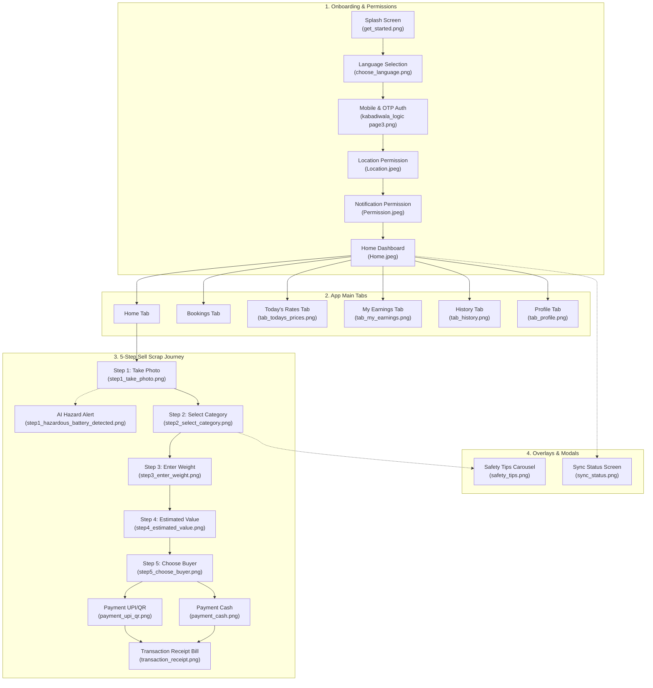

# Kabadiwala Connect — UI Theme Implementation Blueprint & Action Plan

This document serves as the comprehensive implementation guide and actionable TODO roadmap for building the complete, pixel-perfect, reactive frontend prototype for **Kabadiwala Connect** based on the visual designs in `UI_THEME/` and the high-resolution asset packs in `public/assets/`.

---

## 1. Application Architecture & Navigation Matrix



---

## 2. Global Design Tokens & Styling System

| Token Category | Variable Name | Value | Purpose |
| :--- | :--- | :--- | :--- |
| **Primary Brand** | `--brand-deep-green` | `#1C522D` | Primary buttons, headers, accents |
| **Secondary Brand** | `--brand-green` | `#538A46` | Highlights, active icons, tags |
| **Accent Gold** | `--accent-gold` | `#F5B82E` | Key CTA highlights, ratings, badges |
| **Surface Warm** | `--surface-warm` | `#F8FAF6` | Main background color |
| **Card Mint** | `--card-mint` | `#E8F4E6` | Sell Scrap & History cards |
| **Card Warm** | `--card-warm` | `#FAF4EB` | E-Waste & Earnings cards |
| **Alert Red** | `--alert-red` | `#E84D4D` | Live tickers, disputed items |
| **Typography** | `--font-family` | `'Plus Jakarta Sans', system-ui, sans-serif` | Clean modern mobile typography |

---

## 3. Screen-by-Screen Implementation Specifications

---

### Flow 1: Pre-Login & Permission Onboarding

#### Screen 1: Get Started / Splash Screen
- **Reference Image**: [`UI_THEME/get_started.png`](file:///Users/jivitrana/Desktop/Kabadiwala_/UI_THEME/get_started.png)
- **Asset Pack**: `public/assets/Kabadiwala_Connect_UI_Asset_Pack(1)/`
- **Component File**: `src/components/SplashView.jsx`
- **Key UI Elements**:
  - `brand/kc_logo_lockup_transparent.png`: Top logo lockup (K2 + Kabadiwala Connect).
  - `app/splash_hero_illustration_transparent.png`: Two collectors with recycling sack and truck.
  - Headline: `"Connect. Collect. Recycle."`
  - Subheadline: `"A smart way to sell e-waste, earn better and build a cleaner future."`
  - CTA: `"Get Started →"` primary green button.
  - 3 Circular Badges:
    1. `badge_better_prices.png` — *Better Prices* (Know fair rates in real-time)
    2. `badge_easy_pickups.png` — *Easy Pickups* (Schedule pickups at your convenience)
    3. `badge_safe_trusted.png` — *Safe & Trusted* (Verified partners and secure deals)

---

#### Screen 2: Choose Language Screen
- **Reference Image**: [`UI_THEME/choose_language.png`](file:///Users/jivitrana/Desktop/Kabadiwala_/UI_THEME/choose_language.png)
- **Component File**: `src/components/LanguageView.jsx`
- **Key UI Elements**:
  - Top navigation bar with back arrow (`<ArrowLeft />`).
  - Title: `"Choose a Language"`.
  - Language cards: English (`Aa`), हिंदी (`आ`), मराठी (`म`) with radio selection circles.
  - Sticky bottom `"Continue"` button.

---

#### Screen 3: Mobile & OTP Authentication Screen
- **Reference Image**: [`UI_THEME/kabadiwala_logic page3.png`](file:///Users/jivitrana/Desktop/Kabadiwala_/UI_THEME/kabadiwala_logic%20page3.png)
- **Component File**: `src/components/AuthView.jsx`
- **Key UI Elements**:
  - Header with back arrow and `"Skip"` pill button.
  - **Phone Step**: Country code dropdown `+91`, phone number input, Terms & Privacy disclaimer links.
  - **OTP Step**: 4-digit PIN box, subtitle with formatted mobile number, resend countdown, auto-fill demo.
  - Custom responsive numeric keypad (`1-9`, `0`, `backspace`) with alphabet sublabels.

---

#### Screen 4: Location Permission Screen
- **Reference Image**: [`UI_THEME/Location.jpeg`](file:///Users/jivitrana/Desktop/Kabadiwala_/UI_THEME/Location.jpeg)
- **Asset Pack**: `public/assets/Kabadiwala_Connect_Location_UI_Asset_Pack/`
- **Component File**: `src/components/LocationView.jsx`
- **Key UI Elements**:
  - `illustrations/location_hero_transparent_clean.png`: Map illustration with green location pin.
  - Title: `"What's your location?"` & subtitle.
  - 3 Benefit bullets:
    1. `icons/bullet_nearby_badge.png` — *Find nearby partners*
    2. `icons/bullet_faster_badge.png` — *Faster pickups*
    3. `icons/bullet_secure_badge.png` — *Secure & private*
  - Primary button: `"Use Current Location"` with `icons/current_location_clean.png` (white target crosshair).
  - Secondary button: `"Search Location Manually"` with `icons/search_location_clean.png` (green magnifying glass).

---

#### Screen 5: Notification Permission Screen
- **Reference Image**: [`UI_THEME/Permission.jpeg`](file:///Users/jivitrana/Desktop/Kabadiwala_/UI_THEME/Permission.jpeg)
- **Asset Pack**: `public/assets/Kabadiwala_Connect_Notification_UI_Asset_Pack/`
- **Component File**: `src/components/NotificationView.jsx`
- **Key UI Elements**:
  - `illustrations/notification_permission_hero_transparent.png`: Mobile notification switch banner illustration.
  - Title: `"Allow Notifications and Pickup alerts"`.
  - 2 Benefit bullets:
    1. `icons/notif_partner_badge.png` — *Real-time Partner Updates*
    2. `icons/notif_offers_badge.png` — *Offers and news*
  - Primary button: `"Allow Permission"`.
  - Secondary button: `"Maybe Later"`.

---

### Flow 2: Home Dashboard & Navigation

#### Screen 6: Home Dashboard Screen
- **Reference Image**: [`UI_THEME/Home.jpeg`](file:///Users/jivitrana/Desktop/Kabadiwala_/UI_THEME/Home.jpeg)
- **Asset Pack**: `public/assets/Kabadiwala_Connect_Home_UI_Asset_Pack/` & `public/assets/home/`
- **Component File**: `src/components/HomeView.jsx`
- **Key UI Elements**:
  - **Live Marquee Ticker**: Real-time metal scrap quotes and recycling activity.
  - **Deep Green Header**: Logo badge, "Kabadiwala Connect", Notification Bell with yellow pulse dot, greeting (`"Hi, Rakesh!"`), location selector pill (`"Rohini, Delhi ▾"`).
  - **Hero Carousel**: 3 interactive slides (*Scrap Collection Truck, Instant AI Rate Discovery, Highest Payout Guaranteed*).
  - **2x2 Action Hub Grid**:
    1. *Sell Scrap* (`icon_sell_scrap.png`, Mint) → Launches 5-Step Sell Journey.
    2. *E-Waste Collection* (`icon_ewaste.png`, Warm) → Launches AI Camera Scan.
    3. *My Earnings* (`icon_earnings.png`, Warm) → Opens My Earnings view.
    4. *View History* (`icon_history.png`, Mint) → Opens History view.
  - **Market Trends Card**: `icon_trends.png` full-width card linking to Today's Prices.
  - **Fixed 5-Tab Bottom Navigation Bar**: Home, Bookings, Camera Scan (Center Floating FAB), Rates, Profile.

---

### Flow 3: 5-Step "Sell Scrap" Core Flow

```
Step 1: Take Photo ➔ Step 2: Select Category ➔ Step 3: Enter Weight ➔ Step 4: Estimated Value ➔ Step 5: Choose Buyer ➔ Payment (UPI / Cash)
```

#### Screen 7 (Step 1): Take Photo of Scrap
- **Reference Image**: [`UI_THEME/step1_take_photo.png`](file:///Users/jivitrana/Desktop/Kabadiwala_/UI_THEME/step1_take_photo.png)
- **Asset Pack**: `public/assets/Kabadiwala_Connect_Step1_TakePhoto_UI_Asset_Pack/`
- **Component File**: `src/components/sell_flow/Step1TakePhoto.jsx`
- **Key UI Elements**:
  - Stepper indicator: `[1 Photo (Active)] — [2 Category] — [3 Weight] — [4 Value] — [5 Buyer]`.
  - Camera Viewfinder with target corners and live feed simulation (`scrap_photo_reference.jpg`).
  - Viewfinder tooltip pill: `"📷 Position your scrap within the frame"`.
  - Camera Controls: Flash Toggle (Off/On), Central Green Shutter Button with pulse ring, Gallery upload icon.
  - Bottom tip card: `"💡 Take a clear photo — Good lighting and a clear view helps get a better price."`

---

#### Screen 8 (Step 2): Select Scrap Category
- **Reference Image**: [`UI_THEME/step2_select_category.png`](file:///Users/jivitrana/Desktop/Kabadiwala_/UI_THEME/step2_select_category.png)
- **Asset Pack**: `public/assets/Kabadiwala_Connect_Step2_Category_UI_Asset_Pack/`
- **Component File**: `src/components/sell_flow/Step2Category.jsx`
- **Key UI Elements**:
  - Top captured thumbnail preview card: `"Captured Photo • Tap to retake or change"` + `"Change"` button.
  - Title: `"What type of scrap is this?"` (Choose the closest category).
  - 8 Category Selection Cards (2-column grid):
    1. **CRT TV** (`crt_tv_reference.jpg`)
    2. **LCD Display** (`lcd_display_reference.jpg`)
    3. **PCB (Circuit Board)** (`pcb_reference.jpg` - *Selected with green check badge*)
    4. **Cables & Wires** (`cables_wires_reference.jpg`)
    5. **Car Battery** (`car_battery_reference.jpg`)
    6. **Motor & Magnet** (`motor_magnet_reference.jpg`)
    7. **Mixed Plastic** (`mixed_plastic_reference.jpg`)
    8. **Other Items** (`other_items_reference.jpg`)
  - Primary button: `"Next →"`.

---

#### Screen 9 (Step 3): Enter Weight & Bluetooth Scale
- **Reference Image**: [`UI_THEME/step3_enter_weight.png`](file:///Users/jivitrana/Desktop/Kabadiwala_/UI_THEME/step3_enter_weight.png)
- **Asset Pack**: `public/assets/Kabadiwala_Connect_Step3_Weight_UI_Asset_Pack/`
- **Component File**: `src/components/sell_flow/Step3Weight.jsx`
- **Key UI Elements**:
  - Selected category pill (*PCB Circuit Board*) with `"Change"` button.
  - Interactive Stepper Counter:
    - Large digital display: `2.5 kg` (`in 0.5 kg steps`).
    - Minus button (`-`) and Plus button (`+`).
  - Bluetooth Hardware Row: `"Connect Scale — Pair your Bluetooth weighing scale"` with Bluetooth icon.
  - Quick Select approximate weight bag options:
    1. `~ 5 kg` (Lightly filled sack)
    2. `~ 10 kg` (Half filled sack)
    3. `~ 15 kg` (Fully filled sack)
  - Primary button: `"Continue →"`.

---

#### Screen 10 (Step 4): Estimated Value Discovery
- **Reference Image**: [`UI_THEME/step4_estimated_value.png`](file:///Users/jivitrana/Desktop/Kabadiwala_/UI_THEME/step4_estimated_value.png)
- **Asset Pack**: `public/assets/Kabadiwala_Connect_Step4_Estimated_Value_UI_Asset_Pack/`
- **Component File**: `src/components/sell_flow/Step4EstimatedValue.jsx`
- **Key UI Elements**:
  - Selected item header: `PCB / Circuit Board`.
  - Hero Valuation Card:
    - Label: `YOUR ESTIMATED VALUE`.
    - Hero Amount: **`₹312`** (`Based on 2.5 kg of PCB`).
    - Audio button: `"🔊 Listen to value"` (simulates voice assistant quote).
  - Expandable Breakdown Drawer:
    - Formula: `2.5 kg × ₹125/kg = ₹312`.
  - Advantage Highlight Banner:
    - `▲ ₹18 above street rate — You're getting a better price!`
  - Primary button: `"Find a Buyer →"`.

---

#### Screen 11 (Step 5): Choose Buyer
- **Reference Image**: [`UI_THEME/step5_choose_buyer.png`](file:///Users/jivitrana/Desktop/Kabadiwala_/UI_THEME/step5_choose_buyer.png)
- **Asset Pack**: `public/assets/Kabadiwala_Connect_Step5_Choose_Buyer_UI_Asset_Pack/`
- **Component File**: `src/components/sell_flow/Step5ChooseBuyer.jsx`
- **Key UI Elements**:
  - Active Lot Pill: `PCB (Circuit Board) • 2.5 kg`.
  - 3 Verified Buyer Comparison Cards:
    1. **GreenCycle Recycling** (`₹128/kg` • Best price • ★ BEST MATCH • 2.1 km away • CPCB Verified • ★ 4.8) — *Radio selected*
    2. **EcoScrap Solutions** (`₹124/kg` • 3.4 km away • CPCB Verified • ★ 4.6)
    3. **ReNew E-Waste** (`₹121/kg` • 5.2 km away • CPCB Verified • ★ 4.7)
  - Verification Trust Tag: `✓ All listed buyers are verified recyclers.`
  - Sticky Footer: `"Selected: GreenCycle Recycling"` + `"Select & Sell →"` button.

---

### Flow 4: Payment & Fulfillment

#### Screen 12: Payment (UPI / QR Code Mode)
- **Reference Image**: [`UI_THEME/payment_upi_qr.png`](file:///Users/jivitrana/Desktop/Kabadiwala_/UI_THEME/payment_upi_qr.png)
- **Asset Pack**: `public/assets/Kabadiwala_Connect_Payment_UPI_UI_Asset_Pack/`
- **Component File**: `src/components/PaymentView.jsx`
- **Key UI Elements**:
  - Header: `"Payment"`.
  - Amount to receive: **`₹312`** (`Full payment`).
  - Toggle switch: `Cash` vs `UPI` (selected).
  - Dynamic QR Card:
    - QR Code visual with UPI icon.
    - Amount & Recipient: `₹312 • Mudita Recycling`.
    - `"Share payment request"` button.
  - Sticky Footer: `"Payment amount: ₹312 Edit"` + `"Confirm Payment →"` + Helper disclaimer.

---

#### Screen 13: Payment (Cash Mode)
- **Reference Image**: [`UI_THEME/payment_cash.png`](file:///Users/jivitrana/Desktop/Kabadiwala_/UI_THEME/payment_cash.png)
- **Asset Pack**: `public/assets/Kabadiwala_Connect_Payment_UI_Asset_Pack/`
- **Component File**: `src/components/PaymentView.jsx`
- **Key UI Elements**:
  - Toggle switch: `Cash` (selected) vs `UPI`.
  - Cash confirmation card: `"✓ Cash received — Mark this after receiving the cash."`
  - Sticky Footer: `"Confirm Payment →"`.

---

### Flow 5: Standalone Modals & Secondary Tabs

#### Screen 14: AI Battery Detection & Safety Tips Modal
- **Reference Image**: [`UI_THEME/safety_tips.png`](file:///Users/jivitrana/Desktop/Kabadiwala_/UI_THEME/safety_tips.png)
- **Asset Pack**: `public/assets/Kabadiwala_Connect_Safety_Tips_UI_Asset_Pack/`
- **Component File**: `src/components/SafetyTipsModal.jsx`
- **Key UI Elements**:
  - Pill badge: `🔋 Battery detected`.
  - Title: `"A quick safety tip — Before handing over your battery"`.
  - Illustration: Gloved technician handling battery + "No Fire" safety symbol.
  - Tip: `"Keep batteries away from heat — Store them in a cool, dry place until pickup."`
  - Voice narration button: `"🔊 Listen"`.
  - Comparison Badges: `✓ Cool & dry` vs `✗ Heat & flames`.
  - Action buttons: `"Got it"` (primary orange) and `"Remind me later"`.

---

#### Screen 15: Today's Prices / Rates Tab
- **Reference Image**: [`UI_THEME/tab_todays_prices.png`](file:///Users/jivitrana/Desktop/Kabadiwala_/UI_THEME/tab_todays_prices.png)
- **Asset Pack**: `public/assets/Kabadiwala_Connect_Todays_Prices_UI_Asset_Pack/`
- **Component File**: `src/components/tabs/TodaysPricesTab.jsx`
- **Key UI Elements**:
  - Header: Blue title `"Today's Prices"` with audio speaker button & location picker (`Rohini, Delhi ▾`).
  - Live timestamp: `Updated today • Based on recent local transactions`.
  - Rates list with thumbnails, categories, rates, and trend tags:
    - **PCB (Circuit Board)**: `₹128/kg` (`▲ 12%`)
    - **Cables & Wires**: `₹72/kg` (`▼ 8%`)
    - **Car Battery**: `₹62/kg` (`▲ 5%`)
    - **CRT TV**: `₹18/kg` (`▼ 6%`)
    - **LCD Display**: `₹42/kg` (`— Stable`)
    - **Motor & Magnet**: `₹95/kg` (`▲ 9%`)
  - Footnote note card: `Based on the last 42 local transactions. Prices may vary by condition, quantity and buyer.`

---

#### Screen 16: My Earnings & Weekly Analytics Tab
- **Reference Image**: [`UI_THEME/tab_my_earnings.png`](file:///Users/jivitrana/Desktop/Kabadiwala_/UI_THEME/tab_my_earnings.png)
- **Asset Pack**: `public/assets/Kabadiwala_Connect_My_Earnings_UI_Asset_Pack/`
- **Component File**: `src/components/tabs/MyEarningsTab.jsx`
- **Key UI Elements**:
  - Header: `"My Earnings"` with audio speaker button.
  - Weekly Earnings Hero Card:
    - Dropdown: `"This Week ▾"`.
    - Total: **`₹1,240`** (`▲ +18% compared to last week`).
    - Interactive 7-Day Bar Chart: `Mon`, `Tue`, `Wed`, `Thu`, `Fri`, `Sat` (peak), `Sun`.
    - Sprout illustration: `"Small Steps Big Impact"`.
  - Recent Transactions List:
    - PCB: `+₹312` (`Received`)
    - Cables & Wires: `+₹180` (`Received`)
    - Car Battery: `+₹220` (`Pending`)
    - CRT TV: `+₹85` (`Received`)
    - LCD Display: `+₹160` (`Received`)
  - Link card: `"View all transactions →"`.

---

#### Screen 17: Scrap & Lot Transaction History Tab
- **Reference Image**: [`UI_THEME/tab_history.png`](file:///Users/jivitrana/Desktop/Kabadiwala_/UI_THEME/tab_history.png)
- **Asset Pack**: `public/assets/Kabadiwala_Connect_History_UI_Asset_Pack/`
- **Component File**: `src/components/tabs/HistoryTab.jsx`
- **Key UI Elements**:
  - Header: `"History"` with filter sliders button.
  - Segment Tabs: `All` (active), `Active`, `Completed`.
  - Scrap Lot History Cards:
    - **PCB / Circuit Board** (`2.5 kg • 3 Sep 2026 • Lot #A7F2K9`): `₹312` (`● Completed`)
    - **Cables & Wires** (`4.0 kg • 1 Sep 2026 • Lot #B3D9L1`): `₹280` (`● Handed Over`)
    - **Car Battery** (`8.2 kg • 29 Aug 2026 • Lot #C6H4P0`): `₹510` (`● Listed`)
    - **LCD Display** (`3.1 kg • 24 Aug 2026 • Lot #E9V2M8`): `₹190` (`▲ Disputed`)
  - Bottom Banner: `"View Earnings Summary — See total earnings from all your lots →"`.

---

#### Screen 18: Offline Sync Status Screen
- **Reference Image**: [`UI_THEME/sync_status.png`](file:///Users/jivitrana/Desktop/Kabadiwala_/UI_THEME/sync_status.png)
- **Asset Pack**: `public/assets/Kabadiwala_Connect_Sync_Status_UI_Asset_Pack/`
- **Component File**: `src/components/SyncStatusView.jsx`
- **Key UI Elements**:
  - Header: `"Sync Status"`.
  - Status pill: `● Offline • 3 lots waiting to sync`.
  - Offline Notice: `"You're offline, but everything is saved. We'll sync automatically when you're back online."`
  - Queued Lots List (3 lots):
    - PCB (`2.5 kg • Today, 11:24 AM • Lot #A7F2K9`): `₹312` (`🕒 Waiting`)
    - Cables & Wires (`4 kg • Today, 10:42 AM • Lot #B3D9L1`): `₹280` (`🕒 Waiting`)
    - Car Battery (`8.2 kg • Yesterday, 5:16 PM • Lot #C6H4P0`): `₹510` (`🕒 Waiting`)
  - Illustration: Phone with cloud sync lock & security badge (*"Your data is safe"*).
  - Button: `"Try syncing again"` with sync spin animation.

---

#### Screen 19: AI Camera Hazardous Battery Detected Alert Modal
- **Reference Image**: [`UI_THEME/step1_hazardous_battery_detected.png`](file:///Users/jivitrana/Desktop/Kabadiwala_/UI_THEME/step1_hazardous_battery_detected.png)
- **Asset Pack**: `public/assets/Kabadiwala_Connect_Hazardous_Battery_Detected_UI_Asset_Pack/`
- **Component File**: `src/components/sell_flow/HazardousBatteryModal.jsx` (integrated with `Step1TakePhoto.jsx`)
- **Key UI Elements**:
  - Camera Viewfinder with active focus bracket & red bounding box around detected battery: `🔋 Battery detected`.
  - Bottom Alert Sheet:
    - Alert Icon & Heading: `"Hazardous item detected"`
    - Subtitle: `"A battery has been detected in your image. Please follow the safety guidelines below."`
    - Detected Item Card: `Lithium-ion Battery` (*Common in laptops, phones and other electronics.*)
    - Safety Guidelines list:
      - 🔥 *Keep away from heat and fire (Do not expose batteries to high temperatures)*
      - ✋ *Handle with care (Avoid handling damaged or leaking batteries directly)*
      - ♻️ *Dispose safely (Keep in a dry place and hand over to a verified collector or recycler)*
    - Primary Button: `"Got it"` (Continues to Step 2 Category selection or Safety tips).

---

#### Screen 20: Digital Transaction Receipt Bill
- **Reference Image**: [`UI_THEME/transaction_receipt.png`](file:///Users/jivitrana/Desktop/Kabadiwala_/UI_THEME/transaction_receipt.png)
- **Asset Pack**: `public/assets/Kabadiwala_Connect_Transaction_Receipt_UI_Asset_Pack/`
- **Component File**: `src/components/sell_flow/TransactionReceiptView.jsx`
- **Key UI Elements**:
  - Top Bar: Back arrow with centered title `"Receipt"`.
  - Official Receipt Card (Perforated paper ticket aesthetic):
    - Top Brand Lockup: **K2 Kabadiwala Connect** (*Recycle Today, Better Tomorrow*).
    - Meta: `Transaction Receipt #TXN7843291 • 12 Mar 2025, 10:24 AM`.
    - **Paid To Section**: `Rohini Recycling Centre` (`✓ Government Authorised`, Kabadiwala • Rohini, Delhi, Authorization ID: `K2-DL-0891`).
    - **Item Details Section**: PCB / Circuit Board thumbnail with weight `2.5 kg`, unit rate `₹125/kg`, total amount **`₹312`**.
    - **Payment Details**: Payment Method: `UPI (Google Pay)`, Transaction ID: `TXN7843291`, Status: `● Payment Received`.
    - **Green Impact Banner**: Leaf badge with *"Thank you for recycling! You're helping build a cleaner, greener India."*
    - Tagline: *"KEEP RECYCLING, KEEP MAKING A DIFFERENCE"*.
  - Action Buttons:
    - Outlined `Download Bill` (<Download />) and `Share Bill` (<Share2 />).
    - Primary Sticky CTA: `"Done"` (Returns to Home Dashboard).

---

#### Screen 21: User Profile & Account Settings Tab
- **Reference Image**: [`UI_THEME/tab_profile.png`](file:///Users/jivitrana/Desktop/Kabadiwala_/UI_THEME/tab_profile.png)
- **Asset Pack**: `public/assets/Kabadiwala_Connect_Profile_UI_Asset_Pack/`
- **Component File**: `src/components/tabs/ProfileTab.jsx`
- **Key UI Elements**:
  - **User Identity Header Card**:
    - Large mint circular avatar (`R`).
    - Name: **Rakesh**, Phone: `+91 7015363695`.
    - Badge: `● Verified Member` (CPCB verified badge).
    - Outline `Edit` button with pencil icon.
  - **Green Recycling Motivation Banner**:
    - Leaf icon with *"Keep recycling, keep making a difference! Small actions lead to a cleaner, greener tomorrow."*
  - **7-Item Settings Navigation List**:
    1. 👤 **Profile Details**: *View and update your personal details*
    2. 📍 **Address**: *Manage your delivery and pickup address*
    3. 🌐 **Language**: *Choose your preferred language*
    4. 🔄 **Sync Details**: *Sync your data across devices*
    5. 🛡️ **Safety & Hazards**: *Learn about safety guidelines for e-waste*
    6. ⚙️ **App Settings**: *Notifications, privacy and more*
    7. ❓ **Help & Support**: *Get help or contact us*
  - **Fixed 5-Tab Navigation Bar**: Profile tab highlighted active (`#1C522D`).

---

#### Screen 22: Book a Pickup / Bookings Tab
- **Reference Image**: [`UI_THEME/Book_pickup.png`](file:///Users/jivitrana/Desktop/Kabadiwala_/UI_THEME/Book_pickup.png)
- **Asset Pack**: `public/assets/Kabadiwala_Connect_Book_Pickup_UI_Asset_Pack/`
- **Component File**: `src/components/tabs/BookPickupView.jsx`
- **Key UI Elements**:
  - **Top Bar**: Title *"Book a Pickup"* with location selector pill (*"Rohini, Delhi ▾"*).
  - **Next Scheduled Pickup Banner**: Truck icon with *"Rakesh Kumar • Today, 4:00 PM (● Confirmed)"*.
  - **Date Selector Tabs**: Horizontal scrollable day chips (*Today 07 Sep, Tomorrow 08 Sep, Wed 09 Sep, Thu 10 Sep, Fri 11 Sep*).
  - **Available Kabadiwalas Cards List**:
    1. **Rakesh Kumar** (`R` avatar, ★ 4.8 (124) • 1.8 km • *● Available Today* • Verified • Buys: E-waste, Electronics, Cables, Plastic) + `"Book Pickup →"`
    2. **Suresh Kumar** (`SK` avatar, ★ 4.6 (98) • 2.4 km • *● Few slots left* • Buys: Paper, Plastic, Metal, Electronic) + `"Book Pickup →"`
    3. **Amit Sharma** (`AM` avatar, ★ 4.4 (76) • 3.2 km • *● Fully booked* • Buys: Metal, Plastic, Paper) + Disabled `"Fully Booked"`
  - **Interactive Booking Sheet**: Choose time slots, toggle scrap material types, view address, and confirm booking.
  - **Fixed 5-Tab Navigation Bar**: Bookings tab active (`#1C522D`).

---

## 4. Step-by-Step Implementation TODO Checklist

### Phase 1: Asset Pack Clean-Up & Verification
- [x] Verify transparent cropped PNGs for all original 18 screens in `public/assets/`.
- [x] Standardize thumbnail assets across selling flows (`pcb.png`, `cables.png`, `battery.png`, `crt.png`, `lcd.png`, `motor.png`).
- [x] Verify newly added asset packs:
  - `Kabadiwala_Connect_Hazardous_Battery_Detected_UI_Asset_Pack/`
  - `Kabadiwala_Connect_Transaction_Receipt_UI_Asset_Pack/`
  - `Kabadiwala_Connect_Profile_UI_Asset_Pack/`
  - `Kabadiwala_Connect_Book_Pickup_UI_Asset_Pack/`

### Phase 2: Navigation & State Flow Expansion
- [x] Update `src/App.jsx` router/state machine to support the full screen hierarchy:
  - `splash` ➔ `language` ➔ `auth` ➔ `location` ➔ `notification` ➔ `home`.
  - Selling Flow: `step1_photo` ➔ `step2_category` ➔ `safety_tips` ➔ `step3_weight` ➔ `step4_value` ➔ `step5_buyer` ➔ `payment` ➔ `receipt`.
  - Tabs & Overlays: `home`, `book_pickup`, `todays_prices`, `my_earnings`, `history`, `sync_status`, `profile`.
- [x] Update top stepper prototype navigation in `src/components/DeviceFrameWrapper.jsx` to easily navigate to any of the screens.

### Phase 3: Component Implementation
- [x] **Step 1: Take Photo** (`Step1TakePhoto.jsx`): Simulated camera viewfinder, shutter click feedback, flash toggle.
- [x] **Step 2: Category Selection** (`Step2Category.jsx`): 8-item category grid with animated selection.
- [x] **Step 3: Weight Counter** (`Step3Weight.jsx`): Increment/decrement buttons, Bluetooth scale pairing demo, quick-select sacks.
- [x] **Step 4: Estimated Value** (`Step4EstimatedValue.jsx`): Large valuation hero, audio read-aloud simulation, expandable pricing breakdown.
- [x] **Step 5: Buyer Selection** (`Step5ChooseBuyer.jsx`): Buyer radio selection, CPCB verification badges, best-match highlight.
- [x] **Payment View** (`PaymentView.jsx`): Seamless UPI QR code & Cash received modes.
- [x] **Safety Tips Modal / Carousel** (`SafetyTipsView.jsx`): AI battery warning popup with audio advice and multi-tip carousel.
- [x] **Rates Tab** (`TodaysPricesView.jsx`): Real-time price list with market percentage indicators and interactive trend modal.
- [x] **My Earnings Tab** (`MyEarningsView.jsx`): 7-day bar chart with interactive tooltips and recent transactions list.
- [x] **History Tab** (`HistoryTab.jsx`): Filterable transaction lots (`All`, `Active`, `Completed`) and receipt modal sheet.
- [x] **Sync Status View** (`SyncStatusView.jsx`): Offline indicator and interactive sync trigger.
- [x] **AI Hazardous Battery Detection Modal** (`HazardousBatteryModal.jsx` / `Step1TakePhoto.jsx` overlay): Red bounding box detection on camera capture, battery hazard sheet with guidelines.
- [x] **Transaction Receipt Bill View** (`TransactionReceiptView.jsx`): Perforated digital receipt bill with K2 branding, government authorization, payment details, download/share actions.
- [x] **Profile Tab** (`ProfileTab.jsx`): Member card, motivation banner, 7-item navigation menu linking to language, sync, address, and app settings.
- [x] **Book a Pickup / Bookings Tab** (`BookPickupView.jsx`): Next scheduled pickup banner, horizontal date chips, partner ratings/status cards, interactive booking modal with time slots & material selectors.

### Phase 4: Polish & Interactions
- [x] Lock outer device frame scroll containers to prevent any stuck scrolling behavior.
- [x] Add smooth micro-animations for button presses (`:active scale(0.96)`), tab switches, and slide transitions.
- [x] Ensure full responsiveness on mobile viewports and desktop simulator frame.
- [x] Multi-language support (English, Hindi, Marathi) across all views.


