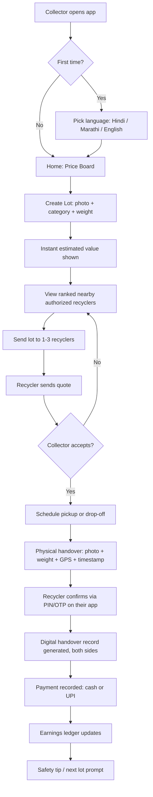
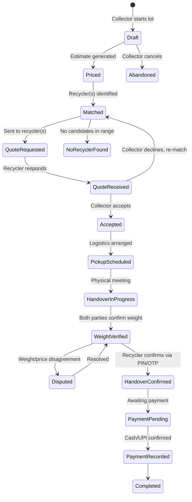
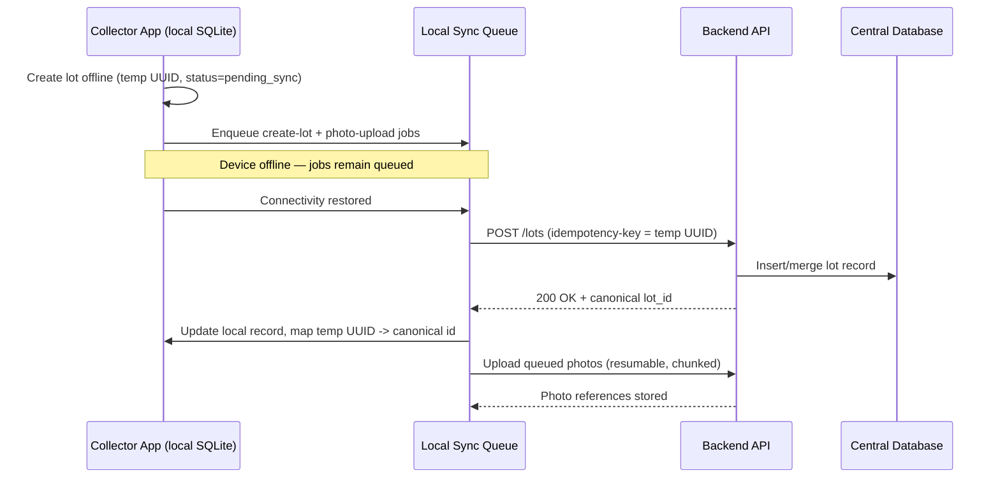
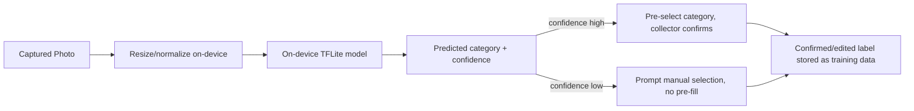
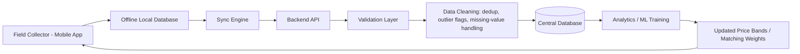
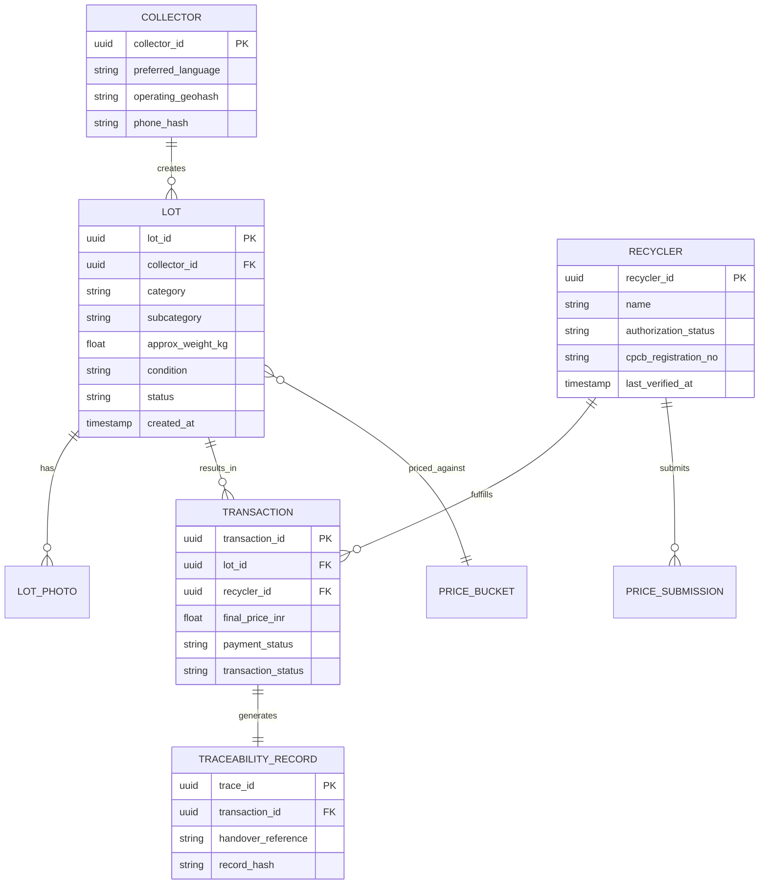

# Kabadiwala Connect
### Bringing the Informal Collector into the Formal E-Waste Recycling Chain
**Problem Statement 26229 · Ministry of Mines / JNARDDC · Clean & Green Technology**

*Version 1.0 — End-to-End Product, Technical, Data, and Business Blueprint*

> **How to read this document:** Every factual claim about Indian law, government schemes, or existing platforms is sourced. Everything else — scoring weights, screen flows, unit-economics numbers, ML accuracy targets — is a **design proposal** and is explicitly marked **[Assumption / Requires Field Validation]** where it has not been tested with real collectors or recyclers. Do not present these as verified facts in a submission; use them as a starting hypothesis to validate in Phase 0 field research (Section: Field Research Plan).

---

## Table of Contents
1. Executive Summary
2. Problem Analysis
3. User Personas
4. Regulatory Research (India E-Waste / EPR / Critical Minerals)
5. Existing Ecosystem & Competitive Analysis
6. Product Vision & Principles
7. End-to-End User Journey
8. Collector App (Design & Flows)
9. Recycler Platform
10. Admin Platform
11. Price Discovery Engine
12. Recycler Matching Algorithm
13. Lot Management & Material Classification
14. Traceability & Digital Handover
15. Payments & Earnings Ledger
16. Safety System
17. Offline-First Architecture
18. Low-End Device Strategy
19. UX/UI Design System
20. AI/ML Architecture
21. Dataset Strategy & Schemas
22. Data Pipeline
23. Database Architecture
24. Backend Architecture & API Design
25. Security & Privacy
26. Analytics & KPIs
27. Field Research Plan
28. Unit Economics
29. Business Model & Sustainability
30. MVP / Pilot / Production Scope
31. Development Roadmap
32. Testing Strategy
33. Edge Cases (30+)
34. Demo Strategy
35. Risks
36. Data & AI Limitations
37. Final Recommendation
38. Implementation Checklist
39. References

---

## 1. Executive Summary

India generates an estimated **1.5–3.8 million tonnes of e-waste annually** (estimates vary by year and methodology; industry sources cite figures from 1.5 to 3.8 million tonnes across recent reporting cycles), and more than **80% of it is still processed through informal channels** rather than CPCB-authorized recyclers. This is not primarily a technology gap — the informal "kabadiwala" network has superior last-mile reach compared to any formal collector. It is an **information and trust gap**: informal collectors do not reliably know fair prices, cannot easily identify which recyclers are legitimately authorized, have no simple way to produce a documented handover, and have no persistent record of their earnings.

**Kabadiwala Connect** is proposed as a vernacular (Hindi/Marathi-first), offline-tolerant Android application that lets an informal collector photograph a lot of e-waste, get an instant fair-value estimate, discover and message nearby *authorized* recyclers ranked by a transparent scoring algorithm, complete a GPS+photo+timestamp verified handover, and see money and history accumulate in a simple ledger — **all without requiring the collector to understand EPR, compliance, or paperwork.** The compliance and traceability value is generated as a *byproduct* of the collector simply trying to earn more money, faster, with less risk of being cheated.

The system explicitly does **not** try to replace kabadiwalas with formal collection — that would fail, because informal collectors are the only actors with genuine last-mile density. Instead it tries to **plug the informal network into the authorized recycler layer that the E-Waste (Management) Rules, 2022 already created**, using price transparency and convenience as the incentive rather than regulation as a stick.

Government policy tailwinds directly relevant to this problem statement: the Union Cabinet approved a **₹1,500 crore Incentive Scheme for critical mineral recycling** under the National Critical Mineral Mission on 3 September 2025, explicitly targeting e-waste, spent lithium-ion batteries, and end-of-life-vehicle catalytic scrap as feedstock, with guidelines released 2 October 2025 <cite index="31-1,31-2,31-3,31-4">The Ministry of Mines has been actively engaging with the private sector to build enough capacity in India to fully utilize electronic waste and recover critical minerals within the next few years. This follows the Union Cabinet's approval on September 3, 2025, of a ₹1,500 crore Incentive Scheme for critical mineral recycling as part of the National Critical Mineral Mission, and detailed guidelines were released on October 2, 2025.</cite> This gives Kabadiwala Connect's traceability dataset direct strategic relevance: better-sourced e-waste feedstock data feeds directly into national supply-chain visibility for lithium, cobalt, nickel, and rare-earth recovery.

---

## 2. Problem Analysis

### 2.1 Why the informal channel dominates
Informal collectors (waste-pickers → kabadiwalas → aggregators) have three structural advantages over formal collection: near-zero fixed cost, hyperlocal density (a collector may cover a few streets daily), and cash-based, no-paperwork transactions that match the economic reality of both sellers (households) and buyers (scrap shops). Any solution that asks this layer to adopt formal-sector overhead (KYC forms, compliance paperwork, bank-only payment) will be rejected at the first friction point.

### 2.2 Why formal channel adoption fails today
Field-level accounts of Chennai's "Kabadiwalla Connect" mapping project describe the informal hierarchy precisely: <cite index="26-8,26-9,26-10">Informal waste pickers, counted as 'level-zero aggregators', traditionally sell recyclable materials found on the streets to their local scrap dealers, known as kabadiwalas — 'level-one aggregators', who segregate and sell the material to 'level two-aggregators' (solid waste dealers) who buy higher volumes and process recyclable waste.</cite> At every level of this chain, price information is opaque and personal-relationship-dependent, which is exactly the gap Recykal's founders identified when building their own waste marketplace: <cite index="24-9">founders quickly realised that the biggest challenge was not waste itself—it was information,</cite> because <cite index="24-8">the entire recycling ecosystem ran on human memory, personal relationships</cite> rather than any shared price or quality record.

### 2.3 The hazard side of the problem
Backyard processing of e-waste (open cable burning to recover copper, acid leaching of PCBs for gold, manual battery breaking) destroys the very high-value fractions the country is now trying to formally recover. National reporting on India's e-waste "urban mining" push confirms the material stakes directly: <cite index="34-6,34-7">Dead batteries yield lithium, cobalt and nickel; LED screens contain germanium; circuit boards hold platinum and palladium; hard disks store rare earths.</cite> The same reporting is blunt about where most of this still goes: <cite index="34-8">Most e-waste, however, is still dismantled in informal backyard workshops.</cite>

### 2.4 Reframing the problem statement
The task is not "build a recycling app." It is: **build a trust and information layer thin enough that an illiterate or semi-literate collector adopts it purely because it makes them more money, faster, with less risk — and design the backend so that every transaction that happens on it automatically produces the traceability and dataset value that regulators, recyclers, and the National Critical Mineral Mission need.**

---

## 3. User Personas

| Persona | Description | Core Need | Device/Connectivity Reality |
|---|---|---|---|
| **Rekha — Waste-picker / Level-0 collector** | Walks a fixed urban route, collects mixed scrap including small e-waste (cables, small PCBs, old phones). Cannot read Devanagari fluently. | Know if what she's carrying is worth anything, without having to ask a middleman. | Feature phone or borrowed/shared entry-level Android; near-zero mobile data budget. |
| **Suresh — Kabadiwala / Level-1 collector (primary persona)** | Owns a handcart or small shop, buys from waste-pickers and households, aggregates into lots, sells onward to a scrap dealer or informal dismantler. Basic literacy, comfortable with WhatsApp voice notes and calls. | Fair, current price data; a way to find buyers *he* isn't already locked into; proof of what he handed over in case of dispute. | Entry-level Android (₹6,000–10,000 class), intermittent 2G/3G/4G, occasionally offline in basements/godowns. |
| **Iqbal — Aggregator / Level-2 dealer** | Runs a scrap godown, buys larger lots from multiple kabadiwalas, currently sells manually to whichever informal buyer offers cash fastest. | Bulk lot management, ability to be discovered by *multiple* authorized recyclers to get competing quotes instead of one relationship. | Better device, sometimes a shared shop computer; still cash-first. |
| **Priya — Recycler operations staff (authorized facility)** | Works at a CPCB/SPCB-registered recycler; needs a steady, quality feedstock pipeline and defensible chain-of-custody records to justify EPR certificates issued to producers. | Discover nearby verified sellers, quote and schedule pickups, generate compliant paperwork automatically. | Desktop/laptop, reliable connectivity, moderate technical literacy. |
| **Ananya — CPCB/SPCB or JNARDDC monitoring stakeholder** | Interested in formalization metrics, critical-mineral feedstock volumes, and unsafe-practice reduction. | Aggregate, anonymized dashboards; not personal collector data. | Web dashboard. |

**[Assumption / Requires Field Validation]:** All persona details above are drawn from secondary research on India's informal waste hierarchy, not the two mandatory field interviews required by the problem statement. They must be validated or corrected against actual field research (Section 27) before being treated as final.

---

## 4. Regulatory Research — India E-Waste, EPR, and Critical Minerals

All claims in this section are sourced to official/primary documents.

### 4.1 E-Waste (Management) Rules, 2022
- Notified by MoEFCC on **2 November 2022**, effective **1 April 2023**, replacing the 2016 Rules and introducing a new EPR regime: <cite index="3-2">Ministry has notified the E-Waste (Management) Rules, 2022 on 2nd November, 2022. These rules will replace E-waste (Management) Rules, 2016 and will be effective from 1st April, 2023. These rules will launch a new Extended Producer Responsibility (EPR) regime for e-waste recycling.</cite>
- Applicability: <cite index="4-2">The E-Waste (Management) Rules, 2022 shall apply to every Manufacturer, Producer, Recycler, Refurbisher and Dismantler involved in manufacture, sale, transfer, purchase, refurbishing, dismantling, recycling and processing of e-waste or electrical and electronic equipment listed in Schedule I.</cite>
- Registration authority: <cite index="4-1">Under the E-Waste (Management) Rules, 2022, CPCB issues registration to the Producers, Recyclers, Refurbishers and Manufacturer of EEEs listed in Schedule-I of the Rules.</cite>
- EPR obligation ramp-up: <cite index="4-3">EPR Obligations are effective from 1st April 2023 and for FY 2023-24 & FY 2024-25 it is 60% of the quantity of waste generation, followed by 70% during FY 2025-26 & FY 2026-27, 80% during FY 2027-28 and onwards.</cite>
- Registration is issued through the online **EPR Portal** (`eprewastecpcb.in` / `eprewaste.cpcb.gov.in`), and CPCB has published a Standard Operating Procedure describing what must be verified before a recycler is registered, including <cite index="8-3">recycling capacity in terms of both raw material and product</cite> and a <cite index="8-2">geotagged video of the unit with all installed plant and machineries (to ensure operational/active video link).</cite>
- A recycler must additionally hold environmental consents outside the EPR portal itself: <cite index="7-1">The recycler should have valid CTO under Air & Water Act along with Authorization under the Hazardous and Other Waste (Management & Transboundary Movement) Rules, 2016 from the concerned SPCB.</cite>
- No unregistered entity may legally trade with a registered one: <cite index="8-4">No entity will carry out any business without registration. The entities registered on the portal shall not deal with any unregistered manufacturer, producer, recycler and refurbisher.</cite>
- Non-compliance is monetized via Environmental Compensation: <cite index="5-1">E-Waste (Management) Rules, 2022 and amendments thereof stipulates that CPCB shall impose Environmental Compensation (EC) in-case of non-compliance of these rules by the registered Producers/Manufacturers/Recyclers/Refurbishers.</cite>

**Product implication:** Kabadiwala Connect's recycler dataset must store CPCB registration number, CTO validity, and Hazardous Waste authorization validity as three separate fields, because they come from different approving authorities (CPCB EPR portal vs. SPCB consent) and can expire independently.

### 4.2 Where authorized-recycler data can be sourced (no public bulk API confirmed)
Public research found **no documented open REST/bulk-download API** for the EPR portal at the time of research; the practical sources are:
1. The **EPR portal's own dashboard view**, which publicly lists granted recycler applications at a URL referenced in a Puducherry state pollution board circular: <cite index="12-2">For additional recyclers from other states the following webpage may be accessed here: https://eprewaste.cpcb.gov.in/#/dashboard-view/recycleApplicationGranted</cite>
2. **State-level published PDFs**, e.g. a CPCB-consolidated national list compiled by NDMC (as of 08-06-2023) covering state-wise dismantler/recycler counts and installed capacity, e.g. for Andhra Pradesh: <cite index="13-1,13-2,13-3">List of Dismantlers/Recyclers as per the authorisation issued by SPCBs/PCCs under E-Waste (Management) Rules (As on 08-06-2023) — Andhra Pradesh had 10 authorised dismantlers/recyclers with installed capacity of 44,002.5 MTA.</cite>
3. **State Pollution Control Board recycler directories**, e.g. Tamil Nadu Pollution Control Board's 2025 directory, explicitly built by cross-referencing CPCB and state systems: <cite index="18-1">TNPCB has prepared this Recycling Directory... based on data sourced from the Central Pollution Control Board's EPR Portal and TNPCB's Online Consent Management and Monitoring System.</cite>
4. A 2015-era parliamentary answer establishing historical baseline scale: <cite index="15-1">there are one hundred forty six (146) registered dismantlers/recyclers of e-waste in the country... distributed across Andhra Pradesh, Chhattisgarh, Gujarat, Haryana, Karnataka, Madhya Pradesh, Maharashtra, Rajasthan, Tamil Nadu, Uttar Pradesh, Uttarakhand and West Bengal.</cite>

**Design decision:** The MVP recycler dataset must be **seeded manually** — scrape/transcribe the CPCB dashboard and 2–3 relevant state SPCB PDF directories for the pilot geography (recommend Maharashtra, given Marathi-language requirement), store as structured records with a `last_verified_at` timestamp and a `source_document_url`, and put a periodic **manual re-verification** task on the admin roadmap rather than assuming an automated feed exists. This is explicitly flagged: **[Assumption / Requires Field Validation]** — teams must re-check at implementation time whether CPCB has since published a public API, since portal capabilities evolve.

### 4.3 National Critical Mineral Mission — direct policy relevance
- <cite index="31-3,31-5">The Union Cabinet's approval on September 3, 2025, of a Rs 1,500 crore Incentive Scheme for critical mineral recycling... Under the scheme, eligible feedstock includes e-waste, used lithium-ion batteries (LIBs), and other scrap such as catalytic converters from end-of-life vehicles.</cite>
- Scale of feedstock: <cite index="31-6">India generates about 1.75 million tonnes of e-waste and 60 kilo tonnes of spent LIBs annually.</cite>
- Scheme scope and targets: <cite index="32-3,32-4,32-5">The scheme tenure is six years 2025-26 to 2030-31, targets the recycling of critical minerals like lithium, cobalt, nickel, copper, and neodymium from secondary sources such as e-waste, lithium-ion battery scrap, and catalytic converters — aiming to produce 40 kilotons of critical minerals annually, attract ₹8,000 crore in investments, and create 70,000 direct and indirect jobs.</cite>
- Feedstock collection is explicitly tied back to EPR formalization: <cite index="31-9">Feedstock collection will also improve through formalization under the Extended Producer Responsibility (EPR) framework, which mandates producers to ensure pro[per collection].</cite>
- NITI Aayog has publicly framed recycling (not mining) as the fastest lever available: <cite index="33-2,33-3">recovering critical minerals from existing waste streams offered the quickest route to reducing India's dependence on imports, as domestic exploration would take years to yield mineable reserves... 'India's critical minerals journey cannot depend on mining alone... E-waste, battery waste, mine overburden and tailings have the potential to become important sources of critical minerals if we can build the right ecosystem around them.'</cite>
- Independent reporting confirms the informal-sector bottleneck at national scale: <cite index="36-1">India is ramping up formal e-waste recycling to recover critical minerals such as lithium, cobalt and nickel... after the country generated nearly 1.5 million tonnes of e-waste last year... though over 80 percent of waste remains processed informally.</cite>

**This is the single strongest positioning argument for a hackathon submission under a Ministry of Mines problem statement:** Kabadiwala Connect is not just an e-waste app — it is upstream feedstock infrastructure for a ₹1,500-crore national critical-minerals recycling scheme that currently has no reliable, traceable way to source material from the 80%+ of e-waste still moving through informal channels.

### 4.4 What is legally required vs. best practice vs. product assumption

| Item | Status |
|---|---|
| Recycler must hold CPCB EPR registration to legally transact with a "producer" for EPR-certificate purposes | **Legal requirement** (Rules, 2022) |
| Recycler must separately hold SPCB Consent to Operate + Hazardous Waste authorization | **Legal requirement** |
| A collector (individual kabadiwala) must personally register on the EPR portal | **Not required** — EPR registration obligations fall on Producers/Recyclers/Refurbishers/Dismantlers, not on individual informal collectors. This is precisely why the app must not force collector-side compliance UX. |
| Digital signatures / blockchain are required for a valid handover record | **No such requirement found** — this is a product design choice, not a legal mandate. Treat lightweight cryptographic proof (hash + OTP) as sufficient for MVP. |
| A specific data-retention or data-localization rule for a collector app of this kind | **Not identified in this research** — apply general good-practice minimization (Section 25) and flag as **[Assumption / Requires Legal Review]**. |

---

## 5. Existing Ecosystem & Competitive Analysis

| Platform | Target user | What it actually does | Gap vs. Kabadiwala Connect |
|---|---|---|---|
| **Recykal Marketplace** (Hyderabad, founded 2015/2016) | Kabadiwalas/aggregators as sellers, recyclers/large buyers as purchasers, B2B focus | (cite index="21-6,21-7">Launched in 2016, the online marketplace has empowered more than 4,000 kabadiwalas across the country... I list the quantity of waste I have and after quality assessment, their team collects waste.</cite> Framed by its founders as "w-commerce": (cite index="23-2,23-3">the sellers are the informal or semi-formal sector sellers such as kabadiwalas or waste aggregators, and the buyers are recyclers... one truck of that will make its way to the closest recycler.</cite> Now uses AI/logistics at large scale, reportedly channelizing (cite index="24-4">over one million metric tonnes of waste into recycling streams</cite> and crossing (cite index="24-3">Rs 1,200 crore in annual recurring revenue.</cite> | Recykal is broad multi-material B2B waste commerce with company-run pickup logistics; it is not designed as a low-literacy, offline-tolerant, vernacular *pocket tool* for an individual street-level collector, and its e-waste vertical is one of several material categories rather than an e-waste-and-critical-minerals-specific traceability product. |
| **Kabadiwalla Connect** (Chennai, social enterprise, 2017 India award-winner) | Level-0/level-1 waste-pickers and kabadiwalas | Conducted a (cite index="26-4,26-5">street-by-street survey of 2,500 informal waste stakeholders... standardized stakeholder and material classifications</cite> and piloted a (cite index="26-6,26-7">point of sale (PoS) device for a Chennai scrap shop to register waste pickers as suppliers and authorize their transactions.</cite> | Proven that structured, standardized field taxonomy of the informal sector is achievable at city scale — directly validates this project's field-research and material-taxonomy approach — but was a general recyclables project (plastics-led), not e-waste/critical-minerals/EPR-authorization focused, and not built around offline-first mobile-first individual collector use with AI valuation. |
| **The Kabadiwala** (Bhopal, founded 2014) | Households/businesses wanting scheduled pickup | (cite index="29-4,29-5">One has to go to their platform, and look for what they can dispose of and at what price. One can schedule the pickup at their convenience, the company will collect and send the waste for recycling.</cite> | This is a demand-side (household) scheduling app, not a supply-side tool that empowers the *collector* with price discovery, recycler matching, and traceability. |

**Genuine differentiation of Kabadiwala Connect:**
1. **E-waste and critical-minerals specific**, not general recyclables — enabling material-specific safety guidance (battery/CRT/PCB hazards) and direct alignment with the National Critical Mineral Mission's feedstock needs.
2. **Collector-first, not marketplace-operator-first** — no requirement for the platform operator to run its own trucks; the app is a discovery/documentation layer, closer to "OLX + a receipts app" than a logistics company.
3. **Explicit authorization verification** surfaced to the collector at the point of decision (Section 6), rather than assuming all listed buyers are legitimate.
4. **Traceability record generated automatically** as an artifact of a normal sale, not a separate compliance step.
5. **True offline-first design** for entry-level Android with no assumption of continuous connectivity — most competitor consumer-facing tools assume smartphone + data availability for household users, not for a collector working all day in the field.

---

## 6. Product Vision & Principles

**Vision statement:** *A collector should never need to trust our word for a price — they should see it. They should never need to trust our word that a recycler is legitimate — they should see a badge and a reason. And they should never need to remember what they sold last month — the app should remember for them.*

### Product Principles
1. **Money first, compliance invisible.** Every screen must answer "how does this help me earn more, right now" before it does anything about traceability or compliance — those happen silently in the background.
2. **See → Understand → Act → Confirm.** Every interaction is icon/photo/audio led, with a single obvious primary action per screen and an explicit confirmation state before anything is submitted.
3. **Offline is the default state, not the exception.** Assume no connectivity until proven otherwise on every screen.
4. **No paperwork burden shifts to the collector.** All documents (weighment slips, EPR-relevant confirmations) are recycler- or system-generated, never collector-authored.
5. **Cash stays legitimate.** Digital payment is optional, never gating.
6. **Transparent trust, not blind trust.** Recycler authorization status, price sources, and match scores are always shown with a one-tap "why" explanation.
7. **Minimum viable personal data.** Collect the least personal information necessary to run the ledger and prevent fraud (Section 25).

---

## 7. End-to-End User Journey



### Failure-tolerant sub-flows (designed up front, not bolted on later)
- **Offline flow:** Steps D–F–local-ledger view work fully offline using cached price data and a locally generated temporary Lot ID; steps G onward (recycler discovery, sending, quotes) require connectivity and are queued with a clear "will send when online" state.
- **No recycler found nearby:** system offers to widen radius, suggests the nearest verified drop-off point, or queues an alert for when a new recycler is verified in range.
- **Recycler rejects lot:** immediate reason code shown (e.g. "material not accepted," "quantity too small") and lot is automatically re-offered to the next-ranked recycler.
- **Price disagreement at handover:** built into the state machine (Section 14) as an explicit `disputed` state with re-negotiation or partial-acceptance rather than forcing binary accept/cancel.

---

## 8. Collector App — Design & Flows

### 8.1 Screen inventory (collector app)

| Screen | Purpose | Primary CTA | Offline behavior | Audio support |
|---|---|---|---|---|
| Language & onboarding | Select Hindi/Marathi/English via flags+audio, 3-step visual tutorial | "Start" | Fully offline | Full narration |
| Home / Price Board | Show today's local buying price per material with trend arrow | "Sell material" (→ Create Lot) | Shows last-synced cached prices with a "last updated X hours ago" badge | Spoken prices on tap |
| Create Lot — Camera | Photograph material (multi-photo) | "Next" | Fully offline, stores to local file system | Voice prompt "take a clear photo" |
| Create Lot — Category | Icon grid (CRT, LCD, PCB, cable, battery, motor, magnet, mixed plastic) with AI-suggested category pre-highlighted | "Confirm category" | AI suggestion works on-device (Section 20); manual override always available | Icon + spoken category name |
| Create Lot — Weight & Condition | Numeric weight entry with large +/- steppers, condition (good/mixed/damaged) as 3 icons | "Get estimate" | Fully offline | Spoken confirmation of weight entered |
| Instant Estimate | Big number: "₹X – ₹Y" with a plain-language basis ("based on today's local PCB price") | "Find buyer" | Computed from last-synced price cache | Spoken value |
| Recycler List | Ranked cards: name, distance, ✅ authorization badge, accepted materials, rate, pickup availability | "Send to this buyer" | Cached list of previously synced recyclers in range; sending requires connectivity | Spoken recycler name + distance |
| Recycler Detail / Why this rank | Full profile + one-line explanation of match score | "Send lot" | Cached | — |
| Quote received (push/SMS-fallback) | Shows offered price vs. estimate | "Accept" / "Negotiate" / "Decline" | Requires connectivity to receive; can act once received | Spoken quote |
| Handover | Camera + auto GPS + timestamp + weight confirmation | "Confirm handover" | Fully offline; queued for recycler confirmation sync | Step-by-step voice guide |
| Payment record | Cash received? Yes/No; UPI reference optional | "Confirm payment" | Fully offline | — |
| Ledger | Today / week / month totals, paid vs. pending, transaction list | — | Fully offline (local source of truth) | Spoken total on tap |
| Safety Hub | Icon-led hazard guidance per material, short audio/animation | — | Fully offline, bundled in APK | Full narration |
| Lot History / Traceability | Timeline per lot with photos and status | — | Fully offline | — |

### 8.2 Handling messy real-world input (explicitly researched, not assumed away)

| Situation | System behavior |
|---|---|
| Mixed materials in one lot | Allow multi-category tagging per lot with per-category approximate weight split; valuation sums each category's estimate; flagged to recycler as "mixed lot — needs on-site sorting" |
| Unknown/unclassifiable material | "Not sure" icon option → captured as `category_unknown`, photo sent to a human-review queue (admin) that also becomes future AI training data; collector still gets a provisional low/wide estimate |
| Low-quality photograph | On-device blur/exposure check prompts "photo unclear, retake?" before allowing progression, but never blocks submission — collector can force-continue after 1 retry prompt |
| Incorrect AI classification | Manual override always visible and always wins; every override is logged (with old/new label) as labeled training data |
| Approximate weights | Weight is always stored as a **range-tolerant field** (e.g. ±10%) rather than false-precision; final sale weight at handover supersedes the estimate weight, both retained for traceability and dispute resolution |
| Duplicate lots | Local dedup heuristic: same category + weight ± tolerance + photo-hash similarity + within a short time window on the same device triggers a soft warning ("Did you mean to edit your last lot?") without blocking |
| Partial lots (sold in installments) | A lot can be split into child lots referencing a parent `lot_id`, each independently traceable |
| Multiple photos | Stored as an array under one lot; first photo is the "cover" used in recycler-facing cards |
| Collector corrections after submission | Lots are editable until `handover_confirmed` status; every edit is versioned, not overwritten, for audit purposes |

---

## 9. Recycler Platform

Designed as a **data-dense professional web app** (desktop-first, works on a basic laptop/shop computer), distinct from the collector's minimal mobile UI.

### 9.1 Screen inventory (recycler web app)
- **Login** — mobile OTP or email+password (facility staff accounts under one organization)
- **Dashboard** — incoming lot requests, today's scheduled pickups, quick stats (accepted/rejected/pending)
- **Incoming Lots** — list/table view with filters by material, distance, weight, collector rating
- **Lot Detail** — full photos, AI-suggested category & confidence, weight, collector location (approximate, privacy-respecting — see Section 25), quote entry field
- **Quote & Scheduling** — send price, propose pickup window or drop-off instructions
- **Handover Verification** — enter/confirm final weighed quantity, generate PIN/OTP or scan collector's QR to confirm receipt
- **Transactions** — full history, exportable for internal record-keeping and EPR-certificate documentation support
- **Facility Profile** — CPCB/SPCB registration numbers, accepted materials, service area polygon, pickup capacity, operating hours
- **Authorization Documents** — upload/renewal reminders for CTO and Hazardous Waste authorization expiry

### 9.2 Why recyclers would actually use this
Recyclers today source feedstock through personal relationships and truckloads negotiated informally (as Recykal's own founders describe of the wider industry). A tool that pre-qualifies leads (correct material category, approximate weight, GPS-verified) and produces ready-made chain-of-custody documentation reduces their sourcing cost and strengthens the paperwork trail they need to justify EPR certificates sold to producers — a direct commercial incentive, not a compliance ask.

---

## 10. Admin Platform

- **Recycler verification queue** — manual review of new recycler sign-ups against CPCB/SPCB source documents (Section 4.2), with `verified / pending / rejected / expired` states
- **Price management** — moderation of field-submitted prices, manual correction tools, stale-price flags
- **Fraud & anomaly review** — surfaces ML-flagged transactions (Section 20D) for human adjudication
- **Dataset management** — export tools for material/price/recycler/transaction datasets (Section 21), with anonymization toggle
- **Safety content management** — CMS for icons/audio/animations per material and language
- **Authorization expiry alerts** — automated reminders before a recycler's CTO/Hazardous Waste authorization lapses
- **Dispute management** — case queue for handover weight/price disagreements

---

## 11. Price Discovery Engine

### 11.1 Data sources for the price dataset (bootstrapping)
1. **Field-collected seed prices** from the mandatory 2+ collector interviews and any additional shop visits during Phase 0 (this is real data collection, not fabrication).
2. **Recycler-submitted current buying rates**, entered directly through the recycler app's profile and updated at will — this is the single best "live" source once recyclers onboard.
3. **Transaction-derived prices** — every completed sale on the platform becomes a new price data point automatically, the fastest-growing and most trustworthy source over time.
4. Explicitly **do not** fabricate a national reference price database; where public commodity references exist (e.g. LME copper price as a directional signal for cable/wire pricing) they can be used as a **trend indicator only**, clearly labeled as an international reference rather than a local buying price.

### 11.2 Price board design
```
┌─────────────────────────────┐
│   PCB (मदरबोर्ड)              │
│   ₹180 – ₹240 / kg           │
│   आपके क्षेत्र में आज          │
│   ▲ +6% पिछले हफ्ते से         │
│   🔊 [tap to hear]            │
└─────────────────────────────┘
```
Uses color (green ↑ / red ↓ / grey flat) **plus** an icon and spoken word for the trend — never color alone, per accessibility principle.

### 11.3 Handling price mechanics
| Factor | Handling |
|---|---|
| Location effect | Prices are stored per `(material_category, location_geohash, date)` bucket; nearby buckets are blended with distance-decay weighting when a specific area has too few data points |
| Quality/condition | A condition multiplier (e.g. "damaged" = 0.6–0.8× of "good" condition price) applied on top of the base category price, tuned per category as data accumulates |
| Weight | Price is quoted per kg/unit; total estimate = price × weight, with a minimum-lot-size note if a recycler requires it |
| Transportation | Shown separately as an "effective price after pickup cost" only once a specific recycler is chosen (avoids polluting the general price board with recycler-specific logistics) |
| Conflicting prices | Store all submissions; publish median with an interquartile range as the "market range," not a single point estimate |
| Stale prices | Any bucket with no update in >14 days is shown with a "may be outdated" flag rather than silently served as current — **[Assumption / Requires Field Validation]** on the exact threshold |
| Manipulation resistance | Outlier submissions beyond ~3 MAD (median absolute deviation) from the recent local median are held for admin review before being blended into the public median (ties into anomaly detection, Section 20D) |


## 12. Recycler Matching Algorithm

### 12.1 Approach: hybrid rule-based + weighted scoring (not ML) for MVP
With near-zero historical transaction volume at launch, a pure ML recommender has no training signal and would be indefensible in front of judges as "real AI." The defensible approach is a **transparent weighted scoring formula**, with an ML re-ranking layer added only once enough transaction history exists (Phase 6+).

### 12.2 Hard filters (applied before scoring — non-negotiable)
1. Recycler authorization status = `verified` (not `pending`/`expired`/`rejected`)
2. Recycler's `materials_accepted` includes the lot's material category
3. Recycler's `service_area` polygon includes the collector's location, OR recycler offers pickup covering that distance

### 12.3 Weighted score (applied to filtered candidates)

```text
Match Score =
  35% Authorization confidence     (verified + recently re-checked scores higher than verified-but-stale)
  20% Effective price to collector (offered rate minus estimated transport/pickup cost, normalized 0-1 across candidates)
  20% Distance / pickup convenience (inverse distance, boosted if pickup_available=true)
  15% Material compatibility fit   (exact category match > partial/mixed-lot acceptance)
  10% Recycler reliability score   (historical on-time pickup %, dispute rate, payment promptness — 0.5 neutral default with no history)
```

Authorization is weighted highest (35%) deliberately: the platform's core social value is steering material toward *legitimate* recyclers, so price should never be able to fully outweigh a stale or borderline authorization status. This is a **product/ethics decision**, not a derived constant — flagged **[Assumption / Requires Field Validation and Judging Justification]**.

### 12.4 Why not pure ML at launch
- Insufficient historical labeled outcome data ("was this a good match?") at MVP stage.
- Rule-based scoring is auditable — a collector or judge can ask "why did you recommend this recycler" and get a real, inspectable answer, which matters enormously for trust-building with a first-time low-literacy user base.
- Migration path: once ≥ a few thousand completed transactions exist, train a learning-to-rank model (e.g. gradient-boosted ranking) using the same five factors as features, validated against actual collector acceptance/repeat-usage as the label — but only as an enhancement layer on top of the same hard filters.

---

## 13. Lot Management & Material Classification

### 13.1 Lot lifecycle state machine



### 13.2 Material classification (see also Section 20A for the ML model)
Category set per problem statement: CRT, LCD panel, PCB, cables, batteries, motors, magnet-bearing assemblies, mixed plastics — extendable via admin CMS without an app update (server-driven category list with bundled offline fallback icons).

---

## 14. Traceability & Digital Handover

### 14.1 Complete lifecycle (as specified in the problem statement, mapped to the state machine above)
```text
Collected → Lot Created → Priced → Recycler Matched → Quote Received →
Accepted → Pickup/Delivery → Weight Verified → Handover Confirmed →
Payment → Recycler Processing → Completed
```

### 14.2 What goes into the digital handover record
| Field | Source | Purpose |
|---|---|---|
| `lot_id` | System-generated (client-side UUID at creation, server-reconciled on sync) | Unique traceable reference |
| Photos (multiple) | Collector's camera, timestamped | Visual proof of material and condition |
| Weight (estimated + final) | Collector entry + recycler weighment | Dispute resolution, valuation |
| GPS (collection point + handover point) | Device location | Geographic traceability |
| Timestamp (creation + handover) | Device clock, server-corrected on sync | Chain-of-custody timing |
| `recycler_id` + confirmation | Recycler app PIN entry or QR scan | Confirms receiving party |
| `handover_reference` | System-generated short alphanumeric code (human-readable, works over SMS as fallback) | Verifiable receipt number both parties can quote |
| Final price + payment status | Both-party entry with cross-check | Financial record |

### 14.3 Verification mechanism — MVP vs. production
| Mechanism | MVP appropriateness | Notes |
|---|---|---|
| SHA-256 hash of (photos + weight + GPS + timestamp + IDs) stored server-side | **Yes — cheap, real tamper-evidence** | Any post-hoc edit changes the hash; sufficient to prove non-tampering without needing a blockchain |
| One-time PIN shown to collector, entered by recycler to confirm receipt | **Yes** | Works offline (PIN generated locally, confirmed once recycler is online) |
| QR code containing `lot_id` + short signature, scanned by recycler app | **Yes, as an alternative to manual PIN entry** | Faster for recycler with many pickups/day |
| Full blockchain ledger | **No — not justified for MVP** | Research found no requirement for blockchain-grade immutability; a hash-chained record in a normal relational database with an append-only audit table achieves the same tamper-evidence at a fraction of the engineering cost and offline complexity. Revisit only if a future regulator mandate specifically requires distributed-ledger proof — no such mandate was found in this research. |

### 14.4 Offline verification
Both PIN and QR approaches can be generated and checked **entirely offline** (PIN is derived locally from lot data + a device secret; the recycler's confirmation is queued and synced once online), which is essential since handovers frequently occur in low-connectivity godowns.

---

## 15. Payments & Earnings Ledger

### 15.1 Design
- **Cash-first:** default payment flow is "Mark as paid (cash)" with a one-tap confirmation — no bank account or UPI ID required to use the app at all.
- **UPI optional:** if both sides have UPI, a payment reference/UTR number can be attached to the transaction record for extra trust, but this is never a gate to completing a sale.
- **Ledger view:** Today / This Week / This Month totals, Paid vs. Pending breakdown, and a scrollable transaction list — each entry tappable to view the full traceability record.

### 15.2 Handling cash, disputes, and fraud
| Concern | Handling |
|---|---|
| How cash transactions are recorded | Self-reported by both parties (collector marks paid, recycler confirms in their app); mismatches flagged, not blocked |
| Payment confirmation | Two-sided confirmation required to move a transaction to `Completed`; single-sided "paid" claims remain `payment_pending` until countersigned or a timeout auto-escalates to admin review |
| Disputes | A `Disputed` state (Section 13.1) with an admin-visible case, evidence being the stored photos/weights from both sides |
| Pending payments | Ledger explicitly separates `pending_dues` from `received`, so a collector always sees what they're owed |
| Fraud reduction | Rate-limiting new-recycler-account transaction volume, cross-checking declared final price against the recycler's own recent price submissions, and the anomaly-detection model (Section 20D) |

---

## 16. Safety System

Material-specific hazard guidance, icon+audio led, no literacy required:

| Material | Key hazard communicated | Format |
|---|---|---|
| Batteries (esp. Li-ion) | Do not puncture, crush, or burn; risk of fire/explosion | Icon (flame + battery + cross) + 15-sec audio + short animation |
| CRTs | Contains leaded glass and hazardous phosphor coating; do not break the tube | Icon (broken glass + skull-lite warning, non-graphic) + audio |
| PCBs | Do not burn cables/boards to recover copper/gold; acid leaching without protection causes chemical burns | Icon (no-flame symbol) + audio |
| Cables | Never burn insulation in open air | Icon + audio |
| General handling | Gloves recommended for sharp components; heavy-lot lifting posture tip | Icon set |

Delivered as bundled assets in the APK (works fully offline), surfaced contextually — e.g. the battery safety card appears automatically the first few times a collector categorizes a lot as "battery."

---

## 17. Offline-First Architecture

### 17.1 Core rule
As established in offline-first engineering practice, the local database is the single source of truth for the UI, and network is a background concern, not a blocking dependency: the UI only ever reads from local storage, never waiting on a network call to render.

### 17.2 What works fully offline
Create lot (photo, category, weight, GPS), view cached prices, view previously synced recycler list, generate a temporary local Lot ID, record a handover (photo/weight/GPS/timestamp + local PIN generation), view the local ledger, and browse the bundled Safety Hub.

### 17.3 What requires connectivity
Sending a lot to recyclers, receiving a quote, recycler-side PIN/QR confirmation reaching the server, and pulling fresh price/recycler data.

### 17.4 Sync architecture


### 17.5 Technology recommendation
| Layer | Recommendation | Why |
|---|---|---|
| Local DB (Android) | **SQLite via Room** (native Android) or **WatermelonDB** (if React Native is chosen) | Both are proven for structured, queryable, large local datasets on Android; Room has the lowest overhead on entry-level devices given native Kotlin |
| Sync queue | Custom lightweight outbox pattern (a `sync_queue` table with job type, payload, retry count, backoff timestamp) processed by a WorkManager background job | Avoids over-engineering; WorkManager is battery- and Doze-mode aware on Android |
| Conflict resolution | **Server-wins for canonical IDs, last-write-wins with versioning for mutable fields, and explicit `Disputed` state for financial fields (price/weight) rather than silent overwrite** | Financial data must never silently "resolve" a conflict — surfacing a dispute state is safer than guessing |
| Idempotency | Client-generated UUID sent as an idempotency key on every create; server deduplicates | Prevents duplicate lots from retried uploads on flaky connections |
| Photo upload | Chunked, resumable upload with local compression before queuing (Section 18) | Minimizes data cost and retry cost on 2G/3G |

### 17.6 Offline ID generation & duplicate prevention
Client generates a UUIDv4 immediately on lot creation; this becomes the permanent primary key server-side too (no separate "temp vs. real" ID needed if UUIDs are used end-to-end — avoids an entire class of remapping bugs). Duplicate-prevention heuristic described in Section 8.2.

### 17.7 Failure modes
| Failure | Recovery |
|---|---|
| Sync fails mid-upload | Resumable chunked upload retries from last confirmed chunk |
| Partial sync (lot synced, photos not) | Lot record shows `photos_pending` until all photo chunks confirmed; recycler view shows placeholder until photos arrive |
| Server unreachable for extended period | Queue persists indefinitely on-device; user is never blocked from creating new lots in the meantime |
| Data corruption on device | Nightly local integrity check (SQLite `PRAGMA integrity_check`) with silent repair or, if unrecoverable, a warning plus re-download of anything already synced to server |

---

## 18. Low-End Device Strategy

| Concern | Recommendation |
|---|---|
| Minimum practical Android version | Android 8.0 (Oreo) as floor, given real-world device distribution among lower-income users in India as of recent years; validate against actual field-device survey during Phase 0 — **[Assumption / Requires Field Validation]** |
| RAM | Target smooth operation on 1.5–2GB RAM devices; avoid loading full-resolution images into memory simultaneously (use thumbnail-first loading) |
| APK size | Target under ~25MB base APK; use vector icons (not bitmap sprite sheets), compress bundled audio, and lazy-load safety-hub media if it grows large |
| Image compression | Compress captured photos client-side (e.g. resize to a max dimension + JPEG quality ~70%) before local storage and before upload — full-resolution originals are unnecessary for classification or dispute evidence |
| Camera optimization | Use the platform's standard camera intent/CameraX rather than a heavy custom camera stack, to reduce APK size and battery draw |
| Local DB size | Prune/paginate old synced lot data from hot storage after a retention window, keeping only ledger summaries locally with full detail fetchable on-demand once online |
| Battery usage | Avoid continuous GPS polling — capture location only at the two moments it matters (lot creation, handover), not as a background tracker |
| Network usage | Defer non-urgent syncs (price/recycler cache refresh) to Wi-Fi-preferred windows where possible; always allow manual "sync now" |

### 18.1 Framework recommendation: **Native Android (Kotlin)**
| Option | Verdict |
|---|---|
| Native Kotlin | **Recommended.** Best control over APK size, battery, camera, and background sync behavior — all critical constraints here. Slightly higher initial dev effort than cross-platform, acceptable given Android-only requirement (no iOS need stated). |
| Flutter | Viable alternative if the team has stronger Flutter expertise; genuinely used in comparable rural offline-first Indian apps (an agricultural-rental offline-first app used exactly this stack). Slightly larger baseline APK size than native. |
| React Native | Least preferred here — typically larger memory footprint and more JS-bridge overhead on very low-end devices; acceptable only if team velocity strongly favors it for a hackathon timeline. |

**Recommendation for a hackathon timeline specifically:** if the team's existing skillset is strongest in React Native or Flutter, prioritize shipping a working demo over an idealized native build — but budget an explicit low-end device test pass (Section 32) regardless of framework choice, since that is where cross-platform frameworks most often fail silently.


## 19. UX/UI Design System

### 19.1 Principles specific to low-literacy, outdoor, low-end-device usage
- **Typography:** minimum 18sp body text, 24sp+ for primary numbers (prices, totals); avoid thin font weights (poor outdoor-sunlight legibility); support Devanagari script rendering-tested explicitly (not just assumed via system font).
- **Touch targets:** minimum 48×48dp, primary CTA buttons full-width and ≥56dp tall.
- **Color semantics:** green = good/confirmed/higher price, red = warning/lower price/error, amber = pending/needs attention — **always paired with an icon or word**, never color-only.
- **Navigation:** no hamburger menu; a persistent 3–4 icon bottom bar (Home/Price, Sell, Ledger, Safety) is the entire navigation surface.
- **Confirmation states:** every destructive or financial action (submit lot, confirm handover, mark paid) shows an explicit confirmation screen with a large checkmark animation, not a toast/snackbar that can be missed.
- **Undo/edit:** any lot remains editable until `HandoverConfirmed`; a visible "edit" pencil icon appears wherever content is user-entered.
- **Audio-first assistance:** a persistent 🔊 icon on every screen with numeric or categorical content, reading the content aloud in the selected language.

### 19.2 Screen archetype: See → Understand → Act → Confirm
Every core flow (create lot, accept quote, confirm handover) is structured as exactly these four steps, never collapsed, never skipped — this consistency is itself an accessibility feature, since users learn the *pattern* once and can then predict every other flow in the app.

---

## 20. AI/ML Architecture

**Guiding rule from the problem statement, taken seriously:** AI is used "wherever sufficient training data is available" — meaning some proposed features are rule-based at MVP and become ML-driven only once real data exists. Overclaiming AI capability without data is explicitly avoided (Section 36).

### 20A. Material Classification (image → category)

- **Model recommendation:** a MobileNetV3-Small or EfficientNet-Lite0 backbone fine-tuned on a small labeled e-waste category dataset, exported to **TensorFlow Lite**, run **on-device** (not server-side) — this is essential given the offline-first requirement: classification must work with zero connectivity.
- **On-device vs. server inference:** on-device is required for offline use; a heavier server-side model can optionally re-classify once synced, purely to improve the training set, never to block the collector's flow.
- **MVP reality check:** at hackathon stage there is no proprietary labeled dataset. The realistic MVP is (a) a small demo model fine-tuned on a handful of public e-waste/PCB image datasets plus photos gathered during field research, explicitly presented as a **proof-of-concept with a small, disclosed sample size**, or (b) a rule-based fallback using EXIF/heuristics plus manual category selection as the real MVP path, with the ML model shown as a roadmap component. **[Assumption / Requires disclosure of exact dataset size and accuracy at submission time — do not claim an unverified accuracy number.]**

### 20B. Approximate Valuation
- **Inputs:** material category, weight, condition, location, recent historical price, live recycler offers.
- **Recommended MVP approach:** a **rules + light regression hybrid** — start with `estimated_value = base_price(category, location, date) × weight × condition_multiplier`, and only once enough transaction outcomes exist, fit a **gradient boosting model (e.g. LightGBM/XGBoost)** using these same features to better capture non-linear location/condition interactions.
- **Why not a complex model immediately:** with a training set in the tens-to-low-hundreds of transactions (realistic for a pilot), a simple regression or the rules-based formula will generalize far better than a high-capacity model, which would overfit and could give collectors misleading valuations — a **real fairness and trust risk**, not just an accuracy metric.

### 20C. Recycler Recommendation
Rule-based weighted scoring (Section 12) at MVP and pilot stage; ML-based **re-ranking only** once sufficient (match → outcome) pairs exist, never replacing the transparent hard filters (authorization, material fit, service area).

### 20D. Transaction Anomaly Detection
- **MVP approach:** simple, explainable **statistical thresholds** — flag a transaction if its final price per kg deviates more than ~3 median absolute deviations (MAD) from the recent local median for that category, or if the same collector/recycler pair completes an implausibly high transaction frequency in a short window.
- **Growth path:** once sufficient volume exists, an **Isolation Forest** or clustering-based multivariate anomaly detector (using price, weight, frequency, and geographic features together) can catch subtler fraud patterns than single-variable thresholds.
- Every flagged transaction goes to a **human admin review queue** — the system never auto-blocks or auto-penalizes based on an anomaly score alone.

### 20E. AI/ML training dataset disclosure requirement
For every AI feature actually implemented in a submission, the team must document: data source, sample size, class balance, known biases (e.g. photos taken in good daylight only), and validation methodology — per the problem statement's explicit dataset-quality requirement.

---

## 21. Dataset Strategy & Schemas

### 21.1 Material Dataset
```json
{
  "material_id": "uuid",
  "category": "PCB",
  "subcategory": "motherboard",
  "description": "string, optional collector note",
  "image_reference": ["url1", "url2"],
  "approx_weight_kg": 2.3,
  "condition": "good | mixed | damaged",
  "source_type": "household | street_collection | shop_purchase",
  "estimated_value_inr": [180, 420],
  "location_geohash": "tdr1v",
  "timestamp": "iso8601"
}
```

### 21.2 Price Dataset
```json
{
  "price_id": "uuid",
  "material_category": "PCB",
  "subcategory": "motherboard",
  "location_geohash": "tdr1v",
  "timestamp": "iso8601",
  "buying_price_inr_per_kg": 200,
  "selling_price_inr_per_kg": 230,
  "quoted_price_inr_per_kg": 210,
  "unit": "kg",
  "recycler_id": "uuid|null",
  "source": "field_survey | recycler_submission | transaction_derived",
  "confidence": 0.0
}
```

### 21.3 Recycler Dataset
```json
{
  "recycler_id": "uuid",
  "name": "string",
  "location": {"lat": 0.0, "lng": 0.0, "address": "string"},
  "materials_accepted": ["PCB", "cables", "batteries"],
  "authorization_details": {
    "cpcb_registration_no": "string",
    "spcb_cto_no": "string",
    "hazardous_waste_auth_no": "string"
  },
  "authorization_status": "verified | pending | expired | rejected",
  "contact": {"phone": "string", "email": "string"},
  "offered_rate": {"PCB": 210},
  "pickup_available": true,
  "service_area": "geojson_polygon",
  "last_verified_at": "iso8601",
  "source_document_url": "string"
}
```

### 21.4 Transaction Dataset
```json
{
  "transaction_id": "uuid",
  "lot_id": "uuid",
  "collector_id": "uuid",
  "material_category": "PCB",
  "quantity_weight_kg": 2.1,
  "quoted_price_inr": 420,
  "final_price_inr": 400,
  "recycler_id": "uuid",
  "collection_location": {"lat": 0.0, "lng": 0.0},
  "handover_location": {"lat": 0.0, "lng": 0.0},
  "collection_timestamp": "iso8601",
  "handover_timestamp": "iso8601",
  "payment_status": "pending | recorded | disputed",
  "transaction_status": "see state machine, Section 13.1"
}
```

### 21.5 Traceability Dataset
```json
{
  "trace_id": "uuid",
  "lot_id": "uuid",
  "photo_reference": ["url1", "url2"],
  "weight_kg": 2.1,
  "timestamp": "iso8601",
  "gps": {"lat": 0.0, "lng": 0.0},
  "handover_reference": "KC-7F3A9C",
  "recycler_confirmation": {"method": "pin | qr", "confirmed_at": "iso8601"},
  "record_hash": "sha256...",
  "transaction_status": "Completed"
}
```

### 21.6 Collector Dataset (kept deliberately minimal)
```json
{
  "collector_id": "uuid",
  "preferred_language": "hi | mr | en",
  "general_operating_location": "geohash, city/ward level only",
  "transaction_history_ref": "join via transaction_id",
  "earnings_history_ref": "derived from completed transactions"
}
```
No name, address, ID-document number, or precise home location is required to use the collector app — phone number (for OTP-based recovery) is the only near-identifying field, and it is optional if device-based local auth is used instead (Section 19 UX principle, Section 25 privacy).

---

## 22. Data Pipeline



- **Validation:** schema validation (required fields, type/range checks — e.g. weight > 0, GPS within India bounding box), plus business-rule checks (e.g. price within a plausible multiple of the local median before auto-publishing).
- **Missing values:** never silently imputed for financial fields (price, weight) — surfaced as incomplete records requiring a follow-up prompt; non-critical fields (subcategory) may default to "unspecified."
- **Duplicates:** deduplicated using the idempotency-key/UUID approach (Section 17.6) plus the fuzzy-duplicate heuristic (Section 8.2).
- **Outliers:** flagged (not deleted) via the MAD-based rule (Section 20D), routed to admin review.
- **Image quality:** basic on-device blur/exposure heuristic at capture time; server-side thumbnailing and (optionally) a quality-scoring pass before use in ML training.
- **Provenance:** every price/material/transaction record retains its `source` field so downstream consumers know whether it's field-survey, recycler-submitted, or transaction-derived.
- **Anonymization:** any dataset export for research/government reporting drops `collector_id` in favor of a rotating pseudonymous key, and precise GPS is generalized to ward/geohash level.
- **Versioning & audit:** every mutable record (price correction, lot edit) is append-only versioned, never overwritten in place.
- **Schema evolution:** additive-only migrations for the MVP-to-pilot transition (new optional fields, never breaking renames) to keep old synced clients compatible.
- **Retention:** raw high-resolution photos can be pruned/archived to cold object storage after a defined window once a transaction is `Completed` and past any dispute window; structured records are retained indefinitely for the traceability value.
- **Model retraining:** scheduled retraining trigger (e.g. monthly, or after N new labeled transactions) rather than continuous online learning, to keep the pipeline auditable and to avoid unvetted model drift with a live financial impact.

---

## 23. Database Architecture

| Data category | Where it lives | Why |
|---|---|---|
| Collector's own draft/recent lots, ledger cache | **On-device SQLite** | Must be available with zero connectivity |
| Canonical lots, transactions, prices, recyclers | **PostgreSQL (central backend)** | Relational integrity across lots/transactions/recyclers/prices; strong consistency needed for financial and traceability data |
| Photos, audio/safety assets | **Object storage (e.g. S3-compatible)** | Large binary blobs don't belong in a relational DB row |
| Hot price-lookup cache, session tokens | **Redis** | Low-latency reads for the price board API and rate-limiting |
| Analytics/ML feature tables | **Analytics warehouse (can be the same Postgres instance with a read replica at MVP scale, upgraded to a dedicated warehouse only if volume demands it)** | Avoid over-engineering a full warehouse at hackathon/pilot scale |

### 23.1 Core relational schema (simplified ER description)



Key constraints: `LOT.status` and `TRANSACTION.transaction_status` are constrained to the enumerations from the state machine (Section 13.1); `RECYCLER.authorization_status` cannot be `verified` without a non-null `cpcb_registration_no` and a `last_verified_at` within the admin-defined re-verification window; foreign keys cascade on soft-delete only (no hard deletes of financial/traceability records).


## 24. Backend Architecture & API Design

### 24.1 Architecture
REST API (simpler client caching semantics and easier offline-sync design than GraphQL for this use case) over a modular monolith at MVP/pilot scale (avoid premature microservices), split into: Auth, Lots, Prices, Recyclers, Matching, Transactions, Ledger, Notifications, Analytics — each as a clean internal module so it *can* be split into services later if scale demands it.

### 24.2 Example endpoints
```text
POST   /auth/otp/request
POST   /auth/otp/verify
POST   /lots                      (idempotent create, client UUID)
GET    /lots/{id}
PATCH  /lots/{id}
POST   /lots/{id}/photos          (chunked upload)
POST   /lots/{id}/match           (returns ranked recycler list)
POST   /lots/{id}/quotes          (recycler submits quote)
POST   /lots/{id}/quotes/{qid}/accept
POST   /lots/{id}/handover        (photos, weight, GPS, timestamp)
POST   /lots/{id}/handover/confirm  (recycler PIN/QR confirmation)
POST   /lots/{id}/payment
GET    /prices?category=PCB&geohash=tdr1v
GET    /prices/trends?category=PCB&geohash=tdr1v
GET    /recyclers/nearby?lat=..&lng=..&category=PCB
GET    /ledger/{collector_id}
GET    /recyclers/{id}/transactions   (recycler-side history)
```

### 24.3 Example request/response
```json
// POST /lots
{
  "client_lot_id": "b3e1...uuid",
  "collector_id": "uuid",
  "category": "PCB",
  "approx_weight_kg": 2.1,
  "condition": "good",
  "location": {"lat": 19.23, "lng": 72.85},
  "created_at_device": "2026-09-05T10:12:00+05:30"
}

// Response
{
  "lot_id": "b3e1...uuid",
  "status": "Priced",
  "estimated_value_inr": [380, 460],
  "price_basis": {"category": "PCB", "median_inr_per_kg": 200, "geohash": "tdr1v"}
}
```

```json
// POST /lots/{id}/match  (response)
{
  "lot_id": "b3e1...uuid",
  "candidates": [
    {
      "recycler_id": "r-001",
      "name": "GreenCycle E-Waste Pvt Ltd",
      "distance_km": 4.2,
      "authorization_status": "verified",
      "match_score": 0.87,
      "score_breakdown": {"authorization": 0.35, "price": 0.18, "distance": 0.16, "material_fit": 0.15, "reliability": 0.03}
    }
  ]
}
```

### 24.4 Auth, rate limiting, validation
- Mobile OTP for collector accounts (device-bound session token after first verification, to minimize repeated OTP friction); recycler/admin accounts use standard email+password or OTP with role-based access control.
- Rate limiting per collector/recycler/IP on lot-creation and quote-submission endpoints to blunt spam/fraud.
- Server-side re-validation of everything the client already validated (never trust client-side checks alone).

---

## 25. Security & Privacy

| Area | Approach |
|---|---|
| Encryption at rest | Standard managed-database encryption at rest for Postgres/object storage |
| TLS | Enforced for all API traffic; sync queue refuses to transmit over plaintext |
| Secure local storage | Android EncryptedSharedPreferences / Keystore for any session tokens; lot photos stored in app-private storage, not shared external storage |
| Token management | Short-lived access tokens + refresh tokens; device-bound refresh to reduce OTP friction without indefinite token lifetime |
| RBAC | Distinct roles: collector, recycler-staff, recycler-admin, platform-admin, read-only-analytics/government-viewer |
| GPS privacy | Collector's precise location is visible only to the specific recycler they've sent a lot to, and only for that transaction's lifetime; the price board and recycler-discovery use geohash-level (not exact-point) location |
| Photo privacy | Photos are of *material*, not people, by product convention; safety-hub copy explicitly instructs collectors not to photograph people |
| Minimal data collection | No name, address, or ID-document number required (Section 21.6) |
| Audit logging | All admin actions (recycler verification, price correction, dispute resolution) logged with actor + timestamp |
| API security | Standard input validation, parameterized queries, dependency scanning; no bespoke crypto beyond the handover hash (Section 14.3) |
| Backup/DR | Regular automated database backups; object storage versioning for photos |

### 25.1 Threat-specific mitigations
| Threat | Mitigation |
|---|---|
| Fake recyclers | Manual admin verification against CPCB/SPCB source documents before `verified` status is ever granted (Section 4.2); periodic re-verification |
| Fake prices | Median/MAD outlier flagging (Section 11.3, 20D) + admin review queue |
| Fake transactions | Two-sided confirmation requirement + anomaly detection (Section 20D) |
| Payment fraud | Two-sided payment confirmation; disputes routed to admin |
| GPS spoofing | Cross-check declared handover GPS against recycler's known facility location within a plausible radius; large mismatches flagged for review |
| Duplicate lots | Idempotency keys + fuzzy-duplicate heuristic (Sections 17.6, 8.2) |
| Account takeover | OTP + device binding; step-up verification for high-value transaction thresholds |
| Data leakage | RBAC, minimal PII, anonymized exports (Section 22) |
| Manipulated images | Basic tamper-evidence via the record hash (Section 14.3); full forensic image-manipulation detection is out of scope for MVP and explicitly flagged as a limitation (Section 36) |
| Recycler impersonation | PIN/QR confirmation tied to a specific authenticated recycler account, not a shareable static code |

---

## 26. Analytics & KPIs

| Category | KPIs |
|---|---|
| Collector | Active collectors, lots created, lots sold, average earnings per lot/day, average price improvement vs. self-reported prior informal price, time-to-sale, repeat usage rate, % of lots routed to formal recyclers |
| Recycler | Active recyclers, quotes sent, quote acceptance rate, pickup completion rate, transaction volume, average feedstock lead time |
| Platform | Successful handovers, sync success rate, transaction completion rate, dispute rate, fraud/anomaly flag rate, average matching distance, average collector price improvement |
| Environmental (where measurable) | Estimated e-waste volume diverted to formal recycling (kg/month), estimated unsafe-processing incidents avoided (proxy: lots that would plausibly have been backyard-processed based on category, e.g. batteries/CRTs, now routed formally), critical-material recovery potential by category (directional estimate only, not a certified figure) |

---

## 27. Field Research Plan

The problem statement mandates field research with at least two working scrap collectors/aggregators. This must be **real, not fabricated**.

### 27.1 Methodology
- **Participant selection:** 2+ collectors/aggregators across at least one street-level (kabadiwala) and one aggregator/godown-level actor if possible, to capture different points in the informal hierarchy.
- **Method:** semi-structured interview (30–45 min) + direct observation of one full transaction cycle if feasible (collection → sale) + a short workflow-mapping sketch session with the collector.

### 27.2 Interview questionnaire (usable as-is)
1. What materials do you currently collect that include electronics (cables, phones, boards, batteries, CRTs)?
2. How do you currently find out what a fair price is for these materials?
3. Who do you currently sell to, and why that buyer specifically (price, trust, distance, relationship)?
4. Have you ever felt cheated on price or weight? What happened?
5. Do you know if any of your buyers are officially "authorized" recyclers? Does that matter to you?
6. How do you get paid — cash, digital, both? Any issues with delayed payment?
7. Do you currently keep any written or phone-based record of what you've sold?
8. What smartphone (if any) do you or someone in your household use? What is it comfortable/uncomfortable to use?
9. How reliable is your mobile network/data where you typically work?
10. Do you burn cables, break batteries, or handle CRTs directly? Are you aware of any health risks in doing so?
11. If you could get a better price by traveling slightly further or waiting a day, would you? What would make that trade-off worth it?
12. What would make you trust a new buyer you've never sold to before?

### 27.3 Observation checklist
- Time taken per collection round; typical daily material mix; how weight is currently estimated/verified (weighing scale? by eye?); how price negotiation actually happens (spoken? gestured? fixed by the buyer?); any visible unsafe handling practice; phone usage pattern during the workday.

### 27.4 Turning observations into requirements
Each observed pain point should map directly to a specific product decision already made in this document (e.g. "no persistent record of sales" → Ledger, Section 15; "doesn't trust unfamiliar buyers" → Authorization badge, Section 6; "network is unreliable mid-route" → Offline-first, Section 17) — and any *new* pain point discovered in the field that is not already covered must be logged as a required scope addition before the pilot phase, not silently ignored.

**[Assumption / Requires Field Validation]:** every persona detail, price-mechanics assumption, and UX pattern in this document is a hypothesis to be confirmed or corrected against this actual field research — this document must not be treated as a substitute for it.

---

## 28. Unit Economics

### 28.1 Current informal route (illustrative structure, not verified figures)
```text
Collection revenue (sale to informal buyer)
  - Transportation/handcart cost
  - Sorting time cost (opportunity cost of labor)
  - Middleman margin (buyer often prices below fair market value)
  - Material losses (e.g. copper burned off with insulation, gold lost in unsafe leaching)
  - Other costs (tools, minor injuries/health cost - unquantified)
= Collector's current net earnings
```

### 28.2 Kabadiwala Connect route (illustrative structure)
```text
Material sale value (transparent price × verified weight, sold to an authorized recycler)
  - Transportation to pickup/drop-off point (potentially higher than the nearest informal buyer, offset by better price)
  - Platform fee (if any — proposed as a small recycler-side commission, not charged to the collector; see Section 29)
  - Other costs (unchanged)
= Collector's net earnings under Kabadiwala Connect
```

### 28.3 Sample illustrative calculation — **[Assumption / Requires Field Validation, all numbers illustrative placeholders to be replaced with real field data]**

| Item | Informal route (illustrative) | Kabadiwala Connect (illustrative) |
|---|---|---|
| PCB lot weight | 2 kg | 2 kg |
| Price received per kg | ₹150 (informal buyer, opaque) | ₹210 (transparent median, authorized recycler) |
| Gross revenue | ₹300 | ₹420 |
| Transport cost | ₹0 (nearest buyer) | ₹20 (slightly farther recycler, or ₹0 if pickup) |
| Net earnings | ₹300 | ₹400 |
| Net improvement | — | **+33%** (illustrative only) |

This table's numbers must be replaced with real prices gathered in Section 27's field research before being used in any submission or pitch.

### 28.4 Business models considered
| Model | Fit assessment |
|---|---|
| Recycler-side transaction commission (e.g. small % of completed sale value, charged to the recycler, not the collector) | **Recommended primary model** — aligns incentives (recyclers pay for qualified, traceable feedstock leads), keeps the collector side free, matches how Recykal-style marketplaces monetize the buy-side rather than the seller-side |
| Flat B2B subscription for recyclers (dashboard/analytics access) | Viable secondary/premium tier once volume justifies it |
| EPR ecosystem partnerships / producer sponsorship | Plausible longer-term channel — producers under EPR obligation may sponsor collection-formalization tools in their operating regions to help meet targets, but requires direct relationship-building beyond MVP scope |
| CSR funding / government pilot grant (e.g. via JNARDDC/Ministry of Mines pilot programs) | Realistic bridge funding for Phase 7–8 field pilot, not a long-term standalone model |
| Charging collectors directly (fee or lower payout) | **Explicitly rejected** — directly contradicts the core adoption principle (Section 6) that the platform must never create a compliance/cost burden for the collector |

---

## 29. Business Model & Sustainability

- **Revenue:** small transaction commission from recyclers (Section 28.4) + optional recycler premium analytics tier + potential government/CSR pilot funding for the initial formalization push.
- **Cost drivers to model (illustrative structure, not verified figures — [Assumption / Requires Field Validation]):**
  - Customer Acquisition Cost (CAC) per active collector — likely dominated by field onboarding effort (in-person demos, trust-building) rather than digital marketing, given the target user.
  - Cost per transaction — cloud infrastructure (API, storage, SMS/OTP costs), which scale sub-linearly with volume.
  - Support cost — a human-assisted onboarding/support channel is likely necessary at pilot stage given low digital literacy; this is a real, non-trivial cost to budget honestly rather than assume away.
  - Recycler-side sales/verification effort — onboarding and manually verifying each recycler (Section 4.2) is a real operational cost, not just a data-entry task.
- **Break-even logic:** because the commission is charged on the recycler side per completed transaction, break-even is a function of (active recycler count × average transactions/month × average commission per transaction) exceeding fixed platform + support costs — the actual crossover point cannot be honestly stated without field-validated commission rates and transaction volumes, and should be modeled as a sensitivity table once real pilot data exists rather than a single asserted number.

---

## 30. MVP / Pilot / Production Scope

| Capability | Hackathon MVP | Pilot | Production |
|---|---|---|---|
| Collector app core flow (lot → price → recycler → handover → ledger) | ✅ Full, on 1-2 real device tests | ✅ Hardened, tested on target device range | ✅ Scaled, monitored |
| Offline-first sync | ✅ Basic outbox + resumable photo upload | ✅ Full conflict-resolution states, tested under real intermittent connectivity | ✅ Production-grade retry/observability |
| Recycler dataset | Manually seeded (10-30 recyclers) from public CPCB/SPCB sources for the pilot geography | Expanded + manually verified per Section 4.2 process | Ongoing verification pipeline with expiry monitoring |
| Price discovery | Seeded from field interviews + a few recycler submissions | Growing from real transactions | Fully transaction-derived with historical trend analytics |
| Recycler matching | Rule-based weighted score (Section 12) | Same, tuned with pilot feedback | Rule-based + ML re-ranking once volume supports it |
| Material classification AI | Small disclosed demo model or rule-based fallback | Improved model with pilot-labeled data | Production model with monitored accuracy/drift |
| Traceability/handover | Hash + PIN confirmation | Same, plus dispute-handling UI | Same, plus optional QR hardware/printed-slip integration for recyclers |
| Payments | Cash-first manual confirmation | Same + optional UPI reference | Same, at scale |
| Safety hub | Bundled icons/audio for core categories | Expanded content, community-validated | Full content library, localized further if new languages added |
| Admin platform | Minimal (recycler verification, price review) | Full dispute/fraud queues | Full ops dashboard |
| Security | Baseline auth, TLS, minimal PII | RBAC hardened, audit logging | Full pen-test, DR drills |


## 31. Development Roadmap

| Phase | Objectives | Key Tasks | Deliverables | Key Risks |
|---|---|---|---|---|
| 0 — Research | Ground every assumption in real data | Field interviews (Section 27), CPCB/SPCB recycler list compilation for pilot geography | Validated personas, seed price dataset, seed recycler dataset | Limited access to willing collector interviewees |
| 1 — UX | Design for the real target user | Wireframes, low-literacy usability test on paper prototypes | Clickable prototype | Designing for an imagined rather than real user |
| 2 — Architecture | Lock core technical decisions | Finalize stack, DB schema, offline sync design | Architecture doc, DB migrations | Over-engineering before requirements are field-tested |
| 3 — Collector MVP | Working core collector flow | Build camera/lot/price/ledger screens, offline sync | Installable APK | Low-end device performance issues discovered late |
| 4 — Recycler MVP | Working recycler-side flow | Build web dashboard, quote/handover confirmation | Recycler web app | Recycler onboarding friction |
| 5 — Dataset pipeline | Make data usable | Validation/cleaning jobs, admin review queues | Working data pipeline | Data quality issues from field entry |
| 6 — AI/ML | Add genuinely useful AI | Train/evaluate classification + valuation models honestly | Documented model cards with disclosed accuracy/limitations | Overclaiming AI capability without adequate data |
| 7 — Field testing | Validate with real users | Run the full flow with the 2+ field-research collectors + 1-2 recyclers | Field test report | Findings that require re-scoping core assumptions |
| 8 — Pilot | Small real-world deployment | Onboard a small cohort in one ward/area | Pilot metrics report | Support cost higher than modeled |
| 9 — Production | Scale | Harden security, monitoring, ops processes | Production-ready platform | Scaling recycler-verification operations |

---

## 32. Testing Strategy

| Test type | Focus |
|---|---|
| Unit tests | Pricing calculations, match-score formula, state-machine transitions |
| Integration tests | API ↔ DB ↔ object storage flows for lot creation, sync, handover |
| API tests | Contract tests for every endpoint in Section 24.2 |
| Offline tests | Airplane-mode create/edit/handover flows, verifying local-first behavior |
| Sync tests | Intermittent connectivity simulation, conflict scenarios, idempotency under retried requests |
| UI tests | Espresso/UI Automator flows for the four-step See→Understand→Act→Confirm pattern |
| Accessibility tests | Font scaling, screen-reader/TalkBack compatibility, color-contrast checks, audio playback correctness in Hindi/Marathi |
| Device compatibility tests | Explicit pass on a real entry-level Android device (not just an emulator), given the low-end-device requirement |
| ML evaluation | Held-out validation set accuracy, confusion matrix per material category, explicit reporting of dataset size/bias |
| Security tests | Auth bypass attempts, RBAC boundary tests, injection testing on all API inputs |
| Load tests | Concurrent lot-creation and sync-storm simulation (e.g. many devices reconnecting after an outage simultaneously) |

### 32.1 MVP test plan (minimum viable)
1. Full happy-path flow on a real entry-level Android device with airplane mode toggled mid-flow.
2. Recycler web app quote → handover confirmation on a separate device/browser session simultaneously.
3. At least one deliberately induced sync conflict (edit the same lot from two "sessions") to confirm the dispute-state behavior rather than silent data loss.
4. Hindi and Marathi audio playback correctness check on-device (not just in an emulator with system TTS assumptions).

---

## 33. Edge Cases

| # | Edge case | Collector sees | Technical handling | Recovery |
|---|---|---|---|---|
| 1 | No internet at lot creation | "Saved — will send when online" | Local-only write, queued | Auto-sync on reconnect |
| 2 | No GPS fix available | "Location not found, retry?" with manual area fallback | Retry loop with timeout; fallback to last-known/geohash-only | Manual coarse location if GPS truly unavailable |
| 3 | Camera failure/permission denied | Clear icon-led prompt to enable permission | Graceful fallback, lot creation still possible with placeholder pending photo | Retry once granted |
| 4 | Wrong AI-suggested category | Manual override always visible | Override logged as training correction | None needed — not an error state |
| 5 | Mixed material lot | Multi-category split flow | Sum of per-category estimates | N/A |
| 6 | Very low weight/value lot | Still shown honestly, low estimate | No artificial minimum threshold imposed | Collector decides whether it's worth listing |
| 7 | No recycler available nearby | "No verified buyer found within X km — widen search?" | Widen radius or queue for future match | Notify when a new match becomes available |
| 8 | Recycler authorization expired mid-listing | Recycler auto-hidden from new matches | `authorization_status` auto-flips to `expired` at expiry date | Recycler must re-verify to reappear |
| 9 | Quote changes after initial offer | Collector notified explicitly, must re-accept | New quote version stored, doesn't silently overwrite | Old quote remains in history |
| 10 | Collector changes mind after accepting | "Cancel lot?" confirmation | Reverts to `Matched` state, recycler notified | Recycler can accept a different lot |
| 11 | Pickup failure (no-show) | Reminder/reschedule prompt | Timeout auto-flags `pickup_missed` | Reschedule or re-match |
| 12 | Weight differs at recycler weighment | Both values shown side by side | `Disputed` state | Admin/manual resolution |
| 13 | Payment delayed | Ledger shows "pending" clearly | `payment_pending` persists past a threshold, alert triggered | Escalation to admin if unresolved |
| 14 | Duplicate lot | Soft warning, not blocked | Fuzzy-duplicate heuristic (Section 8.2) | Collector confirms it's intentional or merges |
| 15 | Lost phone | Ledger/data recoverable via OTP-based re-login on new device | Server is source of truth once synced; only unsynced local-only data is at risk | Encourage frequent sync as a stated best practice |
| 16 | Damaged phone mid-transaction | Same as above, plus any not-yet-synced photos may be lost | Explicit disclosure in onboarding: "sync often to protect your records" | N/A — honest limitation |
| 17 | Fake recycler attempts sign-up | Never reaches `verified` status without admin check against source docs | Manual verification gate (Section 4.2) | Rejected with reason shown |
| 18 | Fake/manipulated photograph | Not cryptographically detectable at MVP | Hash proves the *record* wasn't altered after submission, not that the photo itself is genuine | Flagged as an explicit limitation (Section 36) |
| 19 | GPS spoofing | Cross-checked against recycler facility location plausibility | Large mismatch flagged for review | Manual admin adjudication |
| 20 | Server unavailable | App remains fully usable for offline-capable actions | Queue persists indefinitely | Resumes automatically |
| 21 | Sync conflict on the same lot | `Disputed`/versioned, never silently overwritten | Section 17.5 conflict policy | Manual/versioned resolution |
| 22 | Partial handover (part of a lot rejected on inspection) | Lot splits into accepted/rejected child records | Parent-child lot linkage (Section 8.2) | Rejected portion re-enters matching |
| 23 | Collector has no phone number (borrows one) | Device-based local session rather than mandatory phone-linked identity | Local-auth fallback | Data tied to device until/unless linked to a phone-based account |
| 24 | Multiple family members share one device | Lightweight profile switcher within the app (no separate accounts needed for MVP) | Local profile tagging on lots | N/A |
| 25 | Recycler quotes wildly below market | Flagged in the price-board comparison shown to the collector automatically | Anomaly threshold (Section 20D) | Collector warned before accepting |
| 26 | Collector deliberately mis-declares weight | Cross-checked at recycler weighment | `Disputed` state if mismatch beyond tolerance | Repeated pattern flagged for admin review |
| 27 | Language content missing for a rare material subcategory | Falls back to icon + nearest available language audio | Content-gap logged for admin CMS follow-up | Content team backfills |
| 28 | App update needed but device is offline | App continues functioning on last-installed version | No forced update blocking, only optional prompts | Update applied opportunistically |
| 29 | Extremely large PCB/motor lot exceeding normal weight ranges | Flagged for manual recycler review (may be industrial-scale, out of typical scope) | Threshold-based flag, not a hard block | Recycler decides acceptance |
| 30 | Two recyclers both accept the same lot before collector responds | First accepted quote wins; others are notified the lot is no longer available | Optimistic locking on `quote_accept` | Automatic, no manual resolution needed |
| 31 | Collector operates across a state/SPCB boundary | Recycler authorization is checked against whichever SPCB granted it, not the collector's state | Recycler `authorization_details` stores issuing authority explicitly | N/A |
| 32 | Backend price data momentarily empty for a brand-new category/area | Estimate shown as a wide range with an explicit "limited local data" disclosure rather than a false-precise number | Confidence field surfaced in UI | Improves as data accumulates |

---

## 34. Demo Strategy

### 34.1 Reliable live demo flow
```text
Collector finds material → Takes photo → Creates lot → Gets estimated value →
Sees price board → Finds verified recycler → Gets quote → Accepts →
Recycler receives lot (on a second device/laptop, live) → Handover is verified (PIN/QR) →
Payment is recorded → Collector sees earnings update → Traceability record is generated and shown
```

### 34.2 Making the demo resilient to bad venue connectivity
- **Pre-load a local demo dataset** (cached prices, a pre-verified demo recycler) on the collector device so the offline-capable portion of the flow (lot creation, price estimate, ledger) works with zero reliance on venue Wi-Fi.
- **Use a local network hotspot between the two demo devices** (collector phone + recycler laptop) rather than depending on venue internet for the online-required steps (matching, quote, handover confirmation) — this keeps the "live two-sided" moment reliable without betting on conference Wi-Fi.
- **Have a recorded backup video** of the exact same flow captured beforehand, ready to play if live demo connectivity fails entirely — judges expect this contingency and it does not read as a weakness if used transparently.
- **Show the traceability record and dataset view at the end**, not just the collector-facing screens — judges evaluating a Ministry of Mines problem statement will specifically want to see the data/traceability payoff, not just a nice UI.

---

## 35. Risks

| Risk | Likelihood | Impact | Mitigation |
|---|---|---|---|
| Collectors don't trust a new app enough to switch from known relationships | High | High | Field-validated onboarding, visible authorization badges, price transparency as the core trust-building lever, human-assisted onboarding at pilot stage |
| Recycler dataset becomes stale (authorization lapses unnoticed) | Medium | High | Explicit `last_verified_at` + expiry alerting (Section 10) |
| AI classification overclaimed relative to actual (small) training data | Medium | Reputational/credibility | Full disclosure of dataset size/limitations (Section 20E, 36) |
| Offline sync bugs cause data loss or duplication | Medium | High | Idempotent UUID design, extensive offline/sync test plan (Section 32) |
| Low-end device performance issues (lag, crashes) | Medium-High | High (directly undermines the core requirement) | Mandatory real-device testing early, not just emulator testing |
| Business model fails to sustain operations post-pilot | Medium | High | Conservative, sensitivity-based unit economics (Section 28-29) rather than a single optimistic number; diversify revenue (commission + CSR/government pilot funding) |
| Regulatory/portal changes (e.g. CPCB launches an official API) render the manual recycler-seeding approach redundant or inconsistent | Low-Medium | Medium (opportunity, not just risk) | Design the recycler dataset ingestion as a pluggable source layer so an official feed can be added without a schema rewrite |
| Fraud (fake recyclers, manipulated weights/photos) undermines traceability value | Medium | High | Layered mitigations in Section 25.1; explicit disclosure of what is *not* detectable at MVP (Section 36) |

---

## 36. Data & AI Limitations — Stated Honestly

- **Training data will initially be sparse.** Any classification or valuation model shown at MVP/hackathon stage is trained on a small, likely non-representative sample (limited geography, limited lighting/photo conditions, limited material sub-variety). Accuracy figures from such a model should be reported with the sample size attached, never presented as a general capability claim.
- **ML is inappropriate for the core authorization decision.** Recycler legitimacy must always come from a documented, human-verified check against CPCB/SPCB source records (Section 4.2) — this is explicitly kept out of the AI layer.
- **Human verification is required** for: recycler authorization, any anomaly-flagged transaction, and any low-confidence material classification.
- **Dataset bias:** field-collected data will over-represent whatever geography and season the pilot is run in; price data is highly local and time-sensitive and should never be presented as a national reference price.
- **Image classification limitations:** on-device lightweight models (MobileNet/EfficientNet-Lite class) will struggle with heavily mixed, damaged, or dirty materials, and with subcategories not represented in the training set — the manual-override path (Section 8.2) is not a fallback for edge cases, it is a **structural, permanent part of the design**, because the model is not expected to reach high reliability quickly.
- **Price volatility and regional variation** mean any published "market range" is only as good as its most recent local data points — the stale-price flag (Section 11.3) exists precisely because this is a known, structural limitation, not an occasional glitch.
- **Recycler data quality and authorization data limitations:** as documented in Section 4.2, no confirmed public bulk API for authorized-recycler data was found during this research; the dataset is only as current as the last manual re-verification cycle.
- **Photo authenticity is not cryptographically verified** at MVP (Section 25.1, edge case 18) — the hash mechanism proves the *record wasn't altered after capture*, not that the photographed material matches reality; this is an explicit, disclosed gap, not a hidden one.

---

## 37. Final Recommendation

1. **What exactly should we build?** A native-Android, offline-first collector app plus a lightweight recycler web dashboard, centered on four things: instant price transparency, visible recycler authorization status, a documented (photo+GPS+timestamp+hash) handover, and a persistent earnings ledger — all in Hindi/Marathi-first, icon-and-audio-led UX.
2. **What should we NOT build?** Do not build collector-side compliance/paperwork UX, do not build a full logistics/trucking operation, do not build a blockchain ledger, and do not build a high-capacity ML model that outpaces the actual available training data.
3. **What is the strongest MVP?** The full happy-path flow (Section 34.1) working reliably offline-to-online on one real entry-level Android device, backed by a manually-seeded, source-cited recycler dataset for one pilot geography, demonstrated with two real field-researched collectors.
4. **What technology stack?** Native Kotlin Android + Room/SQLite (or Flutter if team velocity strongly favors it) for the collector app; a React/standard web stack for the recycler dashboard; PostgreSQL + Redis + S3-compatible object storage on the backend; TensorFlow Lite for on-device classification.
5. **What datasets first?** Recycler dataset (manually seeded and sourced, Section 4.2) and a seed Price dataset (from real field interviews) — these two unlock the core value proposition even before transaction volume exists.
6. **What AI should we actually implement?** A disclosed, small-sample material classification model as a proof-of-concept plus a rules-based valuation and matching system — save ML-driven ranking/anomaly detection for after real transaction volume exists.
7. **How should offline functionality work?** Local SQLite as the source of truth, UUID-based idempotent sync, an explicit dispute state for any financial-field conflict rather than silent auto-resolution.
8. **How should recycler matching work?** Hard filters (authorization, material fit, service area) followed by a transparent weighted score (Section 12.3), never a black-box recommendation.
9. **How should price discovery work?** Median + interquartile range per (category, geohash, date) bucket, sourced from field surveys → recycler submissions → transaction-derived data over time, with explicit stale-price flagging.
10. **How should traceability work?** Photo + weight + GPS + timestamp + two-sided PIN/QR confirmation, hashed for tamper-evidence — no blockchain required.
11. **How do we verify recyclers?** Manual admin cross-check against CPCB EPR portal / SPCB directories at onboarding, with periodic re-verification and automatic expiry-based de-listing.
12. **How do we make collectors trust the platform?** Show the "why" behind every price and every recycler ranking; never gate cash payment; never ask for compliance paperwork; make the app visibly, immediately about money in their pocket.
13. **How does the platform make money?** Recycler-side transaction commission, optionally supplemented by a recycler analytics tier and pilot/CSR funding — never a fee on the collector.
14. **How does it scale?** Geography-by-geography recycler dataset expansion (manual verification is the bottleneck, so plan for it explicitly rather than assuming automation), plus a pluggable ingestion layer ready for an official CPCB data feed if one becomes available.
15. **What are the biggest risks?** Collector trust/adoption, recycler dataset staleness, and the temptation to overclaim AI capability relative to real available data.
16. **What makes this genuinely better than existing alternatives?** It is the only reviewed solution that is simultaneously (a) e-waste/critical-minerals specific, (b) built collector-first rather than marketplace-operator-first, (c) genuinely offline-first for entry-level Android, and (d) structured so that authorization verification and traceability are visible, explainable outputs for the collector — not invisible backend compliance machinery they have to take on faith.

---

## 38. Implementation Checklist

- [ ] Conduct field interviews with 2+ real collectors/aggregators (Section 27) — do this **before** finalizing UI copy or pricing logic.
- [ ] Compile and cite a seed recycler dataset for the pilot geography from CPCB dashboard + relevant SPCB directory PDFs (Section 4.2).
- [ ] Lock the offline-first data model (UUID-based lot/transaction IDs) before writing UI screens, since retrofitting ID strategy later is costly.
- [ ] Build the four core collector screens (Price Board, Create Lot, Recycler List, Ledger) with real Hindi/Marathi copy reviewed by a native speaker, not machine-translated placeholder text.
- [ ] Implement the hard-filter + weighted-score matching function as a standalone, unit-tested module before wiring it into the UI.
- [ ] Implement the handover hash + PIN/QR confirmation flow and test it fully offline end-to-end.
- [ ] Test the entire happy path on a real entry-level Android device with airplane mode toggled mid-flow.
- [ ] Document AI model dataset size, source, and limitations honestly before any public/demo claim of accuracy.
- [ ] Prepare the local-hotspot two-device demo setup and a recorded backup video (Section 34.2).
- [ ] Draft the unit-economics table using real field-gathered prices, not the illustrative placeholders in Section 28.3.

---

## 39. References

1. PIB Delhi — Government steps to formalise e-waste recycling; E-Waste (Management) Rules, 2022 notification and EPR regime. https://www.pib.gov.in/PressReleasePage.aspx?PRID=1881761&reg=48&lang=2
2. CPCB — FAQs under E-Waste (Management) Rules, 2022. https://cpcb.nic.in/uploads/Projects/E-Waste/FAQ_ewaste_23012024.pdf
3. CPCB EPR Portal — Environmental Compensation Guidelines under E-Waste (Management) Rules, 2022-25. https://eprewaste.cpcb.gov.in/assets/PDF/EC-Guidelines-under-E-Waste-Management-Rules-2022-25.08.25.pdf.pdf
4. EVTL India — EPR Registration for E-Waste in India, CPCB Certificate overview. https://evtlindia.com/epr-registration-for-electronic-waste-management
5. CPCB — FAQ, E-Waste (Management) Rules, 2022 and amendments. https://eprewaste.cpcb.gov.in/assets/PDF/faqewaste.pdf
6. SOP for Registration of Stakeholders on E-waste Management Portal. https://hrocmms.nic.in/OCMMS/SPCB_DOCUMENTS/EWM.pdf
7. West Bengal OCMMS — EPR E-Waste Registration Procedure. https://wbocmms.nic.in/SPCB_DOCUMENTS/EPR%20EWASTE%20STEP%20BY%20STEP.pdf
8. Hulladek — Breaking Down India's E-Waste Regulations 2022: A Guide for Compliance. https://www.hulladekpwl.com/post/breaking-down-india-s-e-waste-regulations-a-guide-for-compliance
9. Puducherry DSTE — E-waste recyclers authorised by CPCB list + EPR portal dashboard link. https://dste.py.gov.in/ppcc/pdf/waste_management/E-Waste/Recyclers.pdf
10. NDMC — CPCB Approved List of E-Waste Recyclers/Dismantlers (as on 08-06-2023). https://www.ndmc.gov.in/pdf/cpcb_approved_list_of_e-waste_recyclers_dismantler.pdf
11. Toxics Link — List of E-waste Recyclers in India. https://toxicslink.org/publications/iec-bcc-materials/list-of-ewaste-recyclers-in-india
12. eParlib — Parliamentary answer on registered e-waste dismantlers/recyclers. https://eparlib.sansad.in/bitstream/123456789/659672/1/14324.pdf
13. CPCB — EPR Authorisation conditions document. https://www.cpcb.nic.in/uploads/Projects/E-Waste/2319.pdf
14. NDMC — List of CPCB & DPCC Approved E-Waste Vendors. https://www.ndmc.gov.in/cpcb_and_dpcc_approved_e-waste_vendors_list.aspx
15. Tamil Nadu Pollution Control Board — Recyclers Directory 2025. https://tnpcb.gov.in/PDF/Updates/Whats_New/Recyclers_Directory_2025.pdf
16. Maharashtra Pollution Control Board — Recyclers Registration under Battery Waste Management Rules 2022. https://www.mpcb.gov.in/sites/default/files/recyclers_bwm.pdf
17. eParlib — Historical E-Waste Management regulatory background. https://eparlib.nic.in/bitstream/123456789/616421/1/118018.pdf
18. The Better India — Recykal Marketplace and scrap dealer empowerment. https://thebetterindia.com/328356/hyderabad-recykal-marketplace-sell-waste-online-empower-scrap-dealers
19. Rest of World — Interview with Recykal co-founder Anirudha Jalan. https://restofworld.org/2023/3-minutes-with-anirudha-jalan-recykal
20. NITI Aayog Frontier Tech — Recykal AI/data waste-tech platform profile. https://frontiertech.niti.gov.in/story/ai-and-data-are-bringing-millions-of-tonnes-of-waste-back-into-circulation/
21. World Economic Forum — Recykal, India's first waste-commerce platform. https://weforum.org/videos/heres-how-this-startup-has-become-indias-first-waste-commerce-platform
22. ET Play — Finding Riches In Rags: How Recykal Is Digitising Kabadiwallas. https://www.etplay.com/business/finding-riches-in-rags-how-recykal-is-digitising-kabadiwallas/1701364675630
23. ITU AI for Good — Kabadiwalla Connect (Chennai) informal waste-picker mapping and PoS pilot. https://aiforgood.itu.int/indian-firms-digital-solution-for-urban-waste-pickers/
24. The Index Project — Kabadiwalla Connect award profile. https://theindexproject.org/award/nominees/1893
25. Updeed — The Kabadiwala (Bhopal) platform overview. https://updeed.co/?p=5142
26. Tribune India — India pushes for e-waste recycling to recover critical minerals; ₹1,500 crore Incentive Scheme. https://www.tribuneindia.com/news/business/india-pushes-for-e-waste-recycling-to-recover-critical-minerals
27. IAS Gyan — Critical Mineral Recycling: The Future of India's Green Economy (National Critical Mineral Mission scheme details). https://www.iasgyan.in/daily-current-affairs/critical-mineral-recycling-the-future-of-indias-green-economy
28. Down To Earth — NITI Aayog on recycling as fastest path to critical minerals security. https://www.downtoearth.org.in/amp/story/energy/recycling-offers-fastest-path-to-indias-critical-minerals-security-niti-aayog
29. ICE Italy — News on India's e-waste critical minerals sector, backyard workshops. https://www.ice.it/it/news/notizie-dal-mondo/299794
30. PV Magazine India — From waste to resource: recovering critical minerals for solar and EV batteries. https://www.pv-magazine-india.com/2025/11/12/from-waste-to-resource-recovering-critical-minerals-for-solar-and-ev-batteries
31. LetsDataScience — India Expands E-Waste Mining For Critical Minerals. https://letsdatascience.com/news/india-expands-e-waste-mining-for-critical-minerals-162541ad
32. GeekyAnts — Offline-First Mobile App Architecture practices. https://geekyants.com/engineering/mobile-engineering/offline-first-mobile-app-architecture-services
33. IRJET (Issuu) — Design and Development of a Mobile-First Agricultural Equipment Rental App (offline-first, Flutter/SQLite, Hindi/Marathi rural India reference case). https://issuu.com/irjet/docs/design_and_development_of_a_mobile-first_agricultu
34. DEV Community — Offline-First Sync in Flutter with Drift and Riverpod. https://dev.to/mohamed_haizoun_ca3869828/offline-first-sync-in-flutter-with-drift-and-riverpod-5een
35. Locize — Offline-First Apps: Architecture, Frameworks & Real Examples. https://www.locize.com/blog/offline-first-apps

---

*End of document. This blueprint should be treated as a living document — every section marked [Assumption / Requires Field Validation] must be revisited once real field research (Section 27) and pilot data exist.*